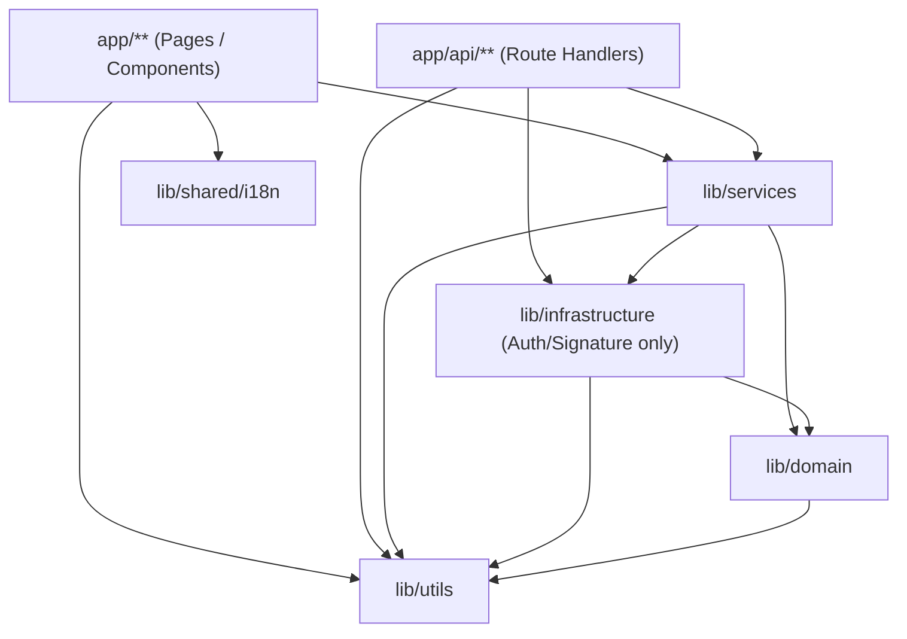

# ADR-001: Target Architecture and Module Boundaries

## Status
Accepted (27 September 2026)

## Context
As EE-CRM evolved through initial spikes and rapid delivery (CRM-001 through CRM-007), the codebase accumulated logic inside a flat `lib/` directory. This directory held an unsegregated mix of pure business rules (`zoom-occurrence.js`), external persistence and API clients (`redis.js`, `db.js`, `schoolmate.js`), application orchestration (`teacher-day.js`), transport helpers (`zoom-signature.js`), and cross-cutting utilities (`timezone.js`).

Additionally, route handlers such as `app/api/teachers/weekly-lessons/route.js` took on domain and orchestration responsibilities, including teacher name normalization, matching algorithms, lesson deduplication, and cache orchestration, blurring the line between transport controllers and domain logic.

To maintain architectural integrity, developer velocity, and testability, EE-CRM establishes this Architectural Decision Record (ADR-001) defining explicit module boundaries, layering constraints, and responsibility ownership.

## Target Module Layout

The target structure under `ee-crm/lib/` organizes application code into four distinct layers plus client-shared assets:

```text
lib/
├── domain/                  # Pure enterprise business logic & data transformations
│   ├── comparison-engine.js # Teacher-day comparison algorithms and status rules
│   └── zoom-occurrence.js   # Pure occurrence reductions, identity hashing, fact models
├── services/                # Application orchestration & business use cases
│   ├── teacher-day.js       # Teacher-day aggregation and reconciliation service
│   └── weekly-schedule-service.js # Weekly lesson aggregation, matching & caching service
├── infrastructure/          # External adapters, persistence, and external APIs
│   ├── auth.js              # NextAuth configuration and token adapters
│   ├── db.js                # Application database repository (Upstash Redis)
│   ├── logger.js            # Structured database-backed logging (ee:app:logs)
│   ├── redis.js             # Shared Redis connection, client modes, health probe
│   ├── schoolmate.js        # Schoolmate REST client with resilience policies
│   ├── zoom.js              # Zoom API client
│   ├── zoom-occurrences.js  # Zoom occurrence projections persistence repository
│   ├── zoom-signature.js    # Zoom webhook HMAC-SHA256 signature verification
│   └── zoom-webhook-handler.js # Zoom webhook ingestion and persistence dispatch
├── utils/                   # Pure cross-cutting utility functions
│   ├── pdf-parser.js        # PDF text and layout extraction helpers
│   └── timezone.js          # Timezone conversions and date string helpers
└── shared/                  # Code shared with or consumed by client components
    └── i18n/                # Client-side localization context and dictionaries
        ├── LanguageContext.js
        └── translations.js
```

## Layer Responsibility Ownership Matrix

| Layer | Primary Responsibility | State & Side Effects | Allowed Inbound Callers | Prohibited Dependencies |
|---|---|---|---|---|
| **Domain** (`lib/domain`) | Core business rules, calculation algorithms, identity hashing, state transformations, pure data normalization. | Stateless, side-effect free, deterministic. | Services, Infrastructure, Tests | Must NEVER import from `infrastructure/`, `services/`, Next.js server/request APIs, or database drivers. |
| **Services** (`lib/services`) | Application use cases, coordinating domain logic with infrastructure adapters, cache policies, fallback orchestration. | Stateful across I/O, orchestrates async flows. | Routes (`app/api`), Server Components, CLI scripts, Tests | Must not depend on HTTP request/response primitives directly; should not be imported by Domain or Infrastructure. |
| **Infrastructure** (`lib/infrastructure`) | External system integration (Redis, Schoolmate, Zoom), database queries, authentication providers, wire protocols. | External network I/O, persistence mutations, system clocks. | Services, Routes (transport-only adapters like auth/signature), Tests | Must not import from `services/`. May import from `domain/` and `utils/`. |
| **Utils** (`lib/utils`) | Reusable pure computational utilities (formatting, parsing, timezone calculations). | Pure functions, stateless. | Any layer (Domain, Services, Infrastructure, UI) | Must not import from `services/` or `infrastructure/`. Must remain agnostic to domain entities. |
| **Shared** (`lib/shared`) | Client/server shared contexts, UI dictionaries, translation tables. | React context, static dictionaries. | UI Components, Pages, Layouts | Must not import backend server infrastructure or database logic. |
| **Transport** (`app/api/**`) | HTTP endpoint controllers, query/body parsing, schema validation, transport error mapping (HTTP 200, 400, 500, 503). | Handles HTTP Request / Response life cycle. | External HTTP clients, Next.js router | Should NOT contain business rules or complex domain transformations; delegates immediately to Services. |

## Dependency Direction & Rules



### Layering Rules

1. **Domain Isolation (Strict):**
   - Pure domain logic (`lib/domain/`) must remain completely decoupled from infrastructure.
   - Domain modules must never import from `@upstash/redis`, database clients, network fetchers, or filesystem adapters.
   - Domain logic must be 100% unit-testable in Node.js without mocks or network sockets.

2. **Thin Controllers:**
   - Next.js Route Handlers (`app/api/**/route.js`) serve strictly as transport adapters.
   - Route handlers are responsible for:
     1. Parsing and validating HTTP request parameters / JSON bodies.
     2. Invoking the appropriate application service in `lib/services/`.
     3. Catching domain/infrastructure exceptions and mapping them to standardized HTTP error payloads and status codes (e.g. `400 Bad Request`, `503 External service unavailable`, `500 Internal server error`).
   - Route handlers must not orchestrate multi-step data pipelines or perform aggregation loops directly.

3. **Infrastructure Encapsulation:**
   - Concrete network and storage adapters (Redis, Schoolmate API, Zoom API) live exclusively in `lib/infrastructure/`.
   - Resilience policies, timeouts, exponential backoff retries, and credential management are encapsulated within the infrastructure adapter.

4. **Shared Utilities:**
   - `lib/utils/` must remain pure and free from infrastructure dependencies. Specifically, `logger.js` is classified under `lib/infrastructure/` because it writes audit logs to the Upstash Redis database (`ee:app:logs`).

## Exceptions & Permitted Deviations

- **Transport-specific Infrastructure Imports:** Route handlers may import authentication utilities (`lib/infrastructure/auth.js`) or webhook signature validators (`lib/infrastructure/zoom-signature.js`) directly when performing perimeter transport validation.
- **Client Localization:** `lib/shared/i18n/` contains React context (`LanguageContext.js`) used in client components (`'use client'`). It is isolated from server-only modules.

## Enforcement

- **Automated Domain Dependency Guard:** Verified by automated tests (`test-crm-008.js`), which statically scan `lib/domain/**/*.js` to assert that zero imports point to `lib/infrastructure/` or `@upstash/redis`.
- **Root Directory Cleanliness:** Root `lib/*.js` must not contain domain, service, or infrastructure files. No compatibility barrel files remain at the old root paths.
- **Code Reviews:** Any PR introducing a reverse dependency (e.g., Domain importing Infrastructure) will be rejected during architectural review.

## Supersession & Evolution

This ADR may only be modified or superseded by a subsequent approved ADR (e.g., ADR-002) following formal software architecture review.
