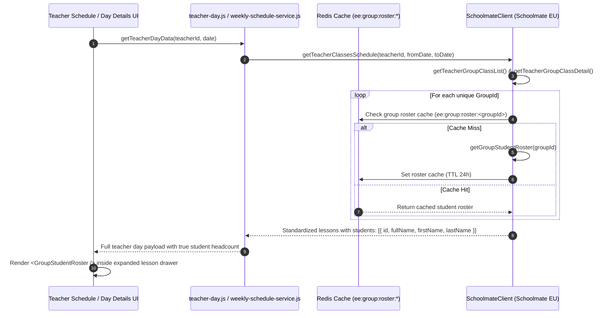
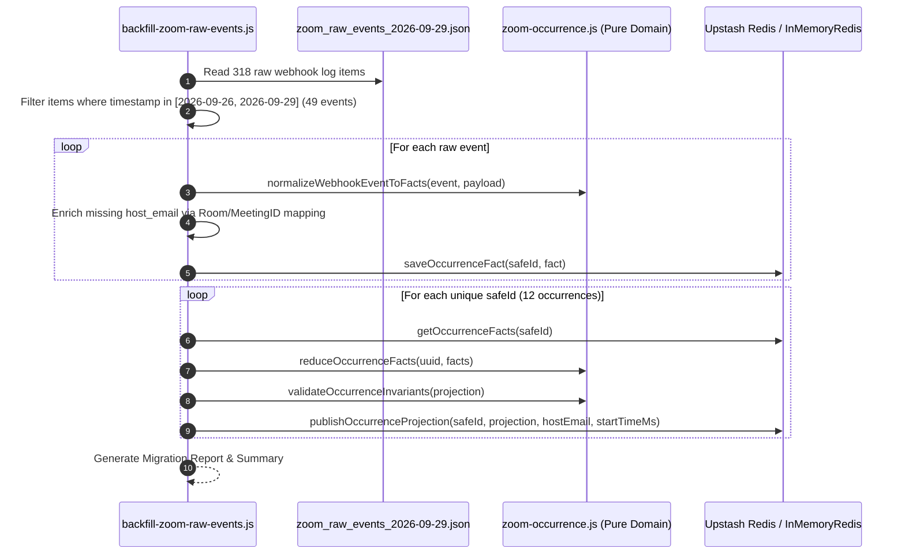
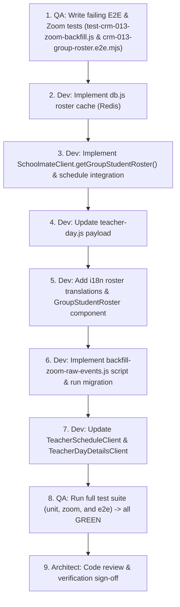

# Architecture: CRM-013 — Display Group Students Roster & Ingest Missing Zoom Raw Events

## Status

Ready

## Related documents

- Story: [CRM-013 — Display Group Students Roster on Teacher and Day Pages](../stories/CRM-013-display-group-students-roster-on-teacher-and-day-pages.md)
- UX specification: [UX: CRM-013 — Display Group Students Roster on Teacher and Day Pages](../ux/CRM-013-display-group-students-roster-on-teacher-and-day-pages.md)
- Related architectural decisions: [ADR-001 — Target Architecture and Module Boundaries](ADR-001-target-architecture-and-module-boundaries.md)
- PRD: [Schedule and Zoom Evidence Review](../PRD.md)
- Raw Events Fixture: `ee-crm/verification/fixtures/zoom_raw_events_2026-09-29.json`

---

## Objective

Deliver an accurate, performant, and visual student roster integration for group and individual lessons, coupled with restoring missing Zoom meeting telemetry for 26–29 September 2026:
1. **Group Student Rosters**: Eliminate misleading duration-based capacity counts (e.g. 90-minute lessons showing `Planned: 9` and unverified `Attended: 9/9`), retrieve authoritative enrolled student rosters from Schoolmate EU, and render lightweight **Flow-Style Student Chips (Pill Badges)** inside expanded lesson cards.
2. **Missing Zoom Telemetry Backfill (26–29 Sep 2026)**: Ingest and adapt 49 raw Zoom webhook events from the legacy system report fixture into EE-CRM Redis, restoring 12 authoritative meeting occurrences across Olha Kushnirchuk (`helhakushnirchuk@gmail.com`) and Irina Zhuravleva (`zhur.zhur.irene@gmail.com`), enabling full side-by-side comparison on Teacher Schedule and Day Details views.

---

## Operational & Migration Guidance

> [!IMPORTANT]
> **Operational Execution Mode**: Autonomous by Dev Agent.
> The data backfill script (`scripts/crm-013/backfill-zoom-raw-events.js`) is fully idempotent and can be executed autonomously by the Developer agent using existing environment variables (`UPSTASH_REDIS_REST_URL` / `UPSTASH_REDIS_REST_TOKEN` or local in-memory fallback).

> [!WARNING]
> ### ⚠️ User Action Required (Production Webhook Configuration)
> While historical missing data (26–29 Sep) will be restored via the backfill script, **future live webhooks** will continue going to the legacy POC until the webhook URL is updated in the Zoom Marketplace App settings:
> - **Action**: Open Zoom Marketplace App Management -> Webhook Subscriptions.
> - **Change Notification Endpoint URL to**: `https://poc-zom-report-2qvs.vercel.app/api/webhooks/zoom`
> - **Verification**: Zoom endpoint validation challenge (CRC) is already implemented and active at that route.

---

## Requirements summary

### Functional requirements

#### A. Group Students Roster
1. **Schoolmate Group Roster Extraction**: Enrich group lessons with the true list of enrolled students fetched from Schoolmate (`/group/groupstudentlist` or `/group/getgroupdetails` / `/student/studentassignlist`).
2. **Accurate Enrolled Student Counts**: Replace duration-derived slot numbers with exact headcount (e.g., `GIZ Group 8 English Empire` displays `6 students`, `NovaPay A2+/2` displays `4 students`, individual lessons display `1 student`).
3. **Decouple False Aggregate Attendance**: Remove automatic `Attended: X/X` claims from lesson summary bars and cards when individual student attendance is not verified.
4. **Flow-Style Student Chips**: Render student names as inline wrapped chips inside the expanded drawer on both `/teachers/[id]` and `/teachers/[id]/[date]` views.
5. **Individual Lesson Support**: Preserve clean single-student rendering for 1-on-1 lessons (`cleanStudentName` with `1 student enrolled`).
6. **Localization**: Support English (`en`), Ukrainian (`uk`), and Polish (`pl`) locale strings for roster headers and student count badges.

#### B. Zoom Missing Data Ingestion & Backfill (26–29 September 2026)
7. **Raw Event Parsing & Filtering**: Read `ee-crm/verification/fixtures/zoom_raw_events_2026-09-29.json` and isolate the 49 events between `2026-09-26T00:00:00.000Z` and `2026-09-29T23:59:59.999Z` (inclusive).
8. **Host Identity Binding**: Resolve missing `host_email` attributes in raw payload objects by matching against known room and meeting identifiers:
   - Meeting ID `9258799407` / Host ID `7-WlHk2wSomxqSVrH_gIHA` / Topic `Olha Kushnirchuk's Personal Meeting Room` -> `helhakushnirchuk@gmail.com`
   - Meeting ID `5558680499` / Host ID `gYfCkJl0SkSzhXNurZQtWg` / Topic `Зал персональной конференции Irina Zhuravleva` -> `zhur.zhur.irene@gmail.com`
9. **Fact-First Storage & Projection**:
   - Normalize raw events into immutable facts via `normalizeWebhookEventToFacts()`.
   - Store facts idempotently under `zoom:occurrence:events:{safeId}` using `saveOccurrenceFact()`.
   - Reduce facts deterministically via `reduceOccurrenceFacts()`.
   - Atomically publish projection to `zoom:occurrence:{safeId}` and add to `zoom:host:occurrences:{hostEmail}` sorted set by start timestamp.
10. **Query Availability**: Ensure `getZoomOccurrencesForTeacher({ teacherZoomEmail, fromDate, toDate })` returns the 12 restored occurrences (10 for Olha Kushnirchuk, 2 for Irina Zhuravleva).

### UX requirements
1. **Vertical Compactness**: Inline wrapped flex chips (`gap: 6px 8px`) keep the left column compact, maintaining vertical parity with the right column (Zoom evidence).
2. **Keyboard & Screen Reader Accessibility**: Semantic `<ul role="list">` and `<li role="listitem">` structure with proper `aria-expanded` and `aria-label` attributes.
3. **Responsive Flow**: Natural wrap across desktop (side-by-side 50/50), tablet, and mobile layouts.

### Non-functional requirements
1. **Performance & Caching**: Cache group rosters in Redis (`ee:group:roster:<groupId>`) with 24-hour TTL to prevent duplicate upstream calls to Schoolmate.
2. **Idempotency & Replay Safety**: Backfill script must be safely re-runnable without creating duplicate occurrence keys, inflating participant session intervals, or corrupting revisions.
3. **Fail-Fast Invariants**: Validate every reduced occurrence against `validateOccurrenceInvariants()`; skip or flag records with missing start timestamps or corrupted IDs.
4. **Strict Architectural Boundaries**: Preserve vertical slice architecture established in CRM-008.

---

## Existing implementation

### Verified Entry Points & Flow
- **Teacher Schedule View** (`ee-crm/app/teachers/[id]/TeacherScheduleClient.js`):
  - Fetches schedule from `/api/teachers/[id]` and Schoolmate reports.
  - Currently renders `👥 Planned: ${lesson.enrolledStudents || 1}` and `Attended: ${attended}/${planned}` (lines 741–747).
  - Expanded drawer currently displays only `rawGroupName` and `enrolledStudents` count badge without student names (lines 757–784).
- **Teacher Day Details View** (`ee-crm/app/teachers/[id]/[date]/TeacherDayDetailsClient.js`):
  - Server route `ee-crm/app/teachers/[id]/[date]/page.js` calls `getTeacherDayData({ teacherId, date })`.
  - Client component renders Schoolmate column on left and Zoom column on right.
  - Queries `getZoomOccurrencesForTeacher` from `ee-crm/lib/infrastructure/zoom-occurrences.js`.
- **Zoom Persistence Layer** (`ee-crm/lib/infrastructure/redis.js` & `ee-crm/lib/domain/zoom-occurrence.js`):
  - `saveOccurrenceFact(safeId, fact)` stores facts under `zoom:occurrence:events:{safeId}`.
  - `reduceOccurrenceFacts(occurrenceIdentity, facts)` builds deterministic projection.
  - `publishOccurrenceProjection(safeId, occurrence, hostEmail, score)` publishes to `zoom:occurrence:{safeId}` and `zoom:host:occurrences:{hostEmail}`.

---

## Proposed solution

### Control and Data Flow

#### 1. Group Student Roster Flow


#### 2. Zoom Missing Data Backfill Pipeline


---

## Architecture decisions

### ADR-013.1: Server-Side Batch Enrichment vs. Client-Side Lazy Fetching
- **Context**: Student rosters can be fetched either upfront on the server during schedule retrieval or lazily on demand when a user expands a specific lesson card.
- **Decision**: Enrich lessons on the server within `SchoolmateClient.getTeacherClassesSchedule` and `teacher-day.js`, backed by Redis roster caching.
- **Rationale**: Upfront enrichment eliminates drawer opening latency and layout shifts during side-by-side verification with Zoom meetings.
- **Tradeoffs**: Slightly larger initial JSON payload (approx. 1–2 KB extra per day), offset by zero client loading spinners.

### ADR-013.2: Flow-Style Inline Chips vs. Table Rows
- **Context**: Displaying 6–12 students per group in traditional table rows takes 300px+ height, pushing the lesson card down and breaking side-by-side alignment with Zoom meetings on the right.
- **Decision**: Adopt inline wrapped pill badges (`.student-chip`) in a flex wrap container.
- **Rationale**: Compresses 6–8 students into 2 compact rows (approx. 60px height), maximizing visual scanability against the Zoom participant list on the right.

### ADR-013.3: Missing Zoom Telemetry Backfill: Fact-First Normalization & Host Mapping Strategy
- **Context**: Zoom raw webhook logs for 26–29 September were delivered to the legacy POC. Some waiting-room and leave events in the raw logs do not contain `host_email` directly in the event object, but contain `host_id`, `topic`, and `id` (meeting ID).
- **Decision**: Use `normalizeWebhookEventToFacts()`, inject resolved `host_email` from deterministic teacher room bindings (`9258799407` -> `helhakushnirchuk@gmail.com`, `5558680499` -> `zhur.zhur.irene@gmail.com`), store raw facts in `zoom:occurrence:events:{safeId}`, and reduce via `reduceOccurrenceFacts()`.
- **Rationale**: Preserves pure event sourcing integrity, guarantees idempotency, and ensures reconstructed occurrences strictly follow the authoritative EE-CRM occurrence schema.

---

## Change impact

### Frontend
- **`ee-crm/app/components/GroupStudentRoster.js`** (New): Reusable student chips roster component.
- **`ee-crm/app/teachers/[id]/TeacherScheduleClient.js`** (Update):
  - Remove `👥 Planned: X · Attended: X/X` from summary bar; display `⏱️ X min` and `👥 X students`.
  - Replace group row with `<GroupStudentRoster />` in expanded drawer.
- **`ee-crm/app/teachers/[id]/[date]/TeacherDayDetailsClient.js`** (Update):
  - Update summary bar and integrate `<GroupStudentRoster />` in expanded drawer.
- **`ee-crm/lib/shared/i18n/translations.js`** (Update):
  - Add `roster` dictionary keys across `en`, `uk`, and `pl`.

### Backend & Services
- **`ee-crm/lib/infrastructure/schoolmate.js`** (Update):
  - Add `getGroupStudentRoster({ groupId })`.
  - Integrate roster fetching and headcount calculation into `getTeacherClassesSchedule()`.
- **`ee-crm/lib/infrastructure/db.js`** (Update):
  - Add `getGroupRosterCache(groupId)` and `setGroupRosterCache(groupId, students, ttl)`.
- **`ee-crm/lib/services/teacher-day.js`** (Update):
  - Pass enriched student rosters and accurate `enrolledStudents` headcount through `getTeacherDayData()`.

### Migration & Ingestion Scripts
- **`ee-crm/scripts/crm-013/backfill-zoom-raw-events.js`** (New):
  - CLI script to ingest raw events from `ee-crm/verification/fixtures/zoom_raw_events_2026-09-29.json` into Redis.
  - Supports `--dry-run`, `--execute`, `--yes`, `--report-file`.

### API Contracts
- Lesson objects in `/api/teachers/[id]` and `getTeacherDayData` include:
  ```json
  {
    "enrolledStudents": 6,
    "isIndividual": false,
    "students": [
      { "id": 357155, "fullName": "Goncharov Andrii", "firstName": "Andrii", "lastName": "Goncharov" },
      { "id": 357156, "fullName": "Khyzhniak Valentyna", "firstName": "Valentyna", "lastName": "Khyzhniak" }
    ]
  }
  ```

### Data Model and Persistence
- Redis Key: `ee:group:roster:<groupId>` (stringified JSON array of student objects, TTL 86400s).
- Redis Keys: `zoom:occurrence:events:{safeId}`, `zoom:occurrence:{safeId}`, `zoom:host:occurrences:{hostEmail}`.

---

## File-level implementation plan

### 1. `ee-crm/lib/infrastructure/db.js`
- **Existing responsibility**: Persistence layer for teachers, logs, and schedule caches.
- **Planned changes**:
  - Add `getGroupRosterCache(groupId)`: queries `ee:group:roster:<groupId>`.
  - Add `setGroupRosterCache(groupId, students, ttlSeconds = 86400)`: stores group roster in Redis with 24h expiration.
  - Support memoryStore fallback in development/test mode.
- **Dependencies**: `./redis.js`.

### 2. `ee-crm/lib/infrastructure/schoolmate.js`
- **Existing responsibility**: Direct HTTP client for Schoolmate EU API.
- **Planned changes**:
  - Add `getGroupStudentRoster({ groupId })` to fetch assigned students from Schoolmate (`/group/groupstudentlist` or `/group/getgroupdetails`).
  - In `getTeacherClassesSchedule()`, collect all unique `groupId`s and resolve their rosters via cache / API.
  - Assign `students: roster` and `enrolledStudents: roster.length` to each lesson item.
  - Set `isIndividual: roster.length <= 1`.
- **Dependencies**: `./db.js` (for roster caching).

### 3. `ee-crm/lib/services/teacher-day.js`
- **Existing responsibility**: Authoritative teacher-day evidence provider.
- **Planned changes**:
  - Ensure `getTeacherDayData()` maps `students`, `isIndividual`, and `enrolledStudents` from `cachedSchedule` into `dayLessons`.
- **Dependencies**: `../infrastructure/schoolmate.js`, `../infrastructure/db.js`.

### 4. `ee-crm/app/components/GroupStudentRoster.js` — new file
- **Responsibility**: Render flow-style student chips for expanded lesson drawers.
- **Planned contents**:
  - Semantic `<ul role="list">` container with flex wrap styling (`gap: 6px 8px`).
  - Mapping of `students` to `.student-chip` pills with user icon `👤` and name.
  - Distinct section labels for group vs. individual classes using `useLanguage()`.
  - Empty state note when roster is empty.
- **Dependencies**: `react`, `@/lib/shared/i18n/LanguageContext`.

### 5. `ee-crm/app/teachers/[id]/TeacherScheduleClient.js`
- **Existing responsibility**: Client component for weekly teacher schedule.
- **Planned changes**:
  - Replace duration-based `Planned: X` / `Attended: X/X` in summary bar with `⏱️ X min` and `👥 X students`.
  - Render `<GroupStudentRoster students={lesson.students} isIndividual={isIndividual} />` in expanded drawer.
- **Dependencies**: `@/app/components/GroupStudentRoster`.

### 6. `ee-crm/app/teachers/[id]/[date]/TeacherDayDetailsClient.js`
- **Existing responsibility**: Client component for daily teacher comparison view.
- **Planned changes**:
  - Update lesson summary bar and integrate `<GroupStudentRoster />` in expanded drawer.
- **Dependencies**: `@/app/components/GroupStudentRoster`.

### 7. `ee-crm/lib/shared/i18n/translations.js`
- **Existing responsibility**: Multi-language dictionary for `en`, `uk`, and `pl`.
- **Planned changes**:
  - Add `roster` namespace translations:
    - `enrolledStudents`: `'Enrolled Students ({count})'` / `'Зараховані учні ({count})'` / `'Zapisani studenci ({count})'`
    - `enrolledStudent`: `'Enrolled Student:'` / `'Зарахований учень:'` / `'Zapisany student:'`
    - `studentsCount`: `'{count} students'` / `'{count} учнів'` / `'{count} studentów'`
    - `noStudents`: `'No students enrolled'` / `'Немає зарахованих учнів'` / `'Brak zapisanych studentów'`
- **Dependencies**: None.

### 8. `ee-crm/scripts/crm-013/backfill-zoom-raw-events.js` — new file
- **Responsibility**: Standalone idempotent migration CLI script to adapt and backfill missing 26–29 Sep Zoom raw events from fixture into Redis.
- **Planned contents**:
  - Reads `ee-crm/verification/fixtures/zoom_raw_events_2026-09-29.json`.
  - Filters by date range `2026-09-26T00:00:00.000Z` to `2026-09-29T23:59:59.999Z`.
  - Resolves `host_email` mappings:
    - `9258799407` / `7-WlHk2wSomxqSVrH_gIHA` / `Olha Kushnirchuk's Personal Meeting Room` -> `helhakushnirchuk@gmail.com`
    - `5558680499` / `gYfCkJl0SkSzhXNurZQtWg` / `Зал персональной конференции Irina Zhuravleva` -> `zhur.zhur.irene@gmail.com`
  - Stores facts using `saveOccurrenceFact()`.
  - Reduces projections using `reduceOccurrenceFacts()`.
  - Publishes projections using `publishOccurrenceProjection()`.
  - Outputs detailed execution summary report.
- **Dependencies**: `@upstash/redis`, `dotenv`, `../../lib/domain/zoom-occurrence.js`, `../../lib/infrastructure/redis.js`.

### 9. `ee-crm/test-crm-013-zoom-backfill.js` — new file
- **Responsibility**: Automated test suite covering Zoom missing data ingestion, reduction invariants, and teacher query integrity.
- **Planned contents**:
  - Runs backfill logic against InMemoryRedis.
  - Asserts exactly 12 occurrences are saved across the date range:
    - Olha Kushnirchuk (`helhakushnirchuk@gmail.com`): 10 occurrences (3 on Sep 26, 2 on Sep 28, 5 on Sep 29).
    - Irina Zhuravleva (`zhur.zhur.irene@gmail.com`): 2 occurrences (1 on Sep 27, 1 on Sep 29).
  - Asserts `getZoomOccurrencesForTeacher({ teacherZoomEmail: 'helhakushnirchuk@gmail.com', fromDate: '2026-09-28', toDate: '2026-09-29' })` returns the occurrences.
  - Asserts participant session intervals and non-inflated union durations.
- **Dependencies**: `node:test`, `node:assert`, `../lib/infrastructure/zoom-occurrences.js`, `../lib/domain/zoom-occurrence.js`.

---

## Testing strategy

### Unit & Integration tests (`test-crm-013.js` & `test-crm-013-zoom-backfill.js`)
- Test `SchoolmateClient.getGroupStudentRoster()` mapping and error fallback.
- Test `db.getGroupRosterCache()` and `db.setGroupRosterCache()` with TTL.
- Test `getTeacherClassesSchedule()` integration: verifies `enrolledStudents` reflects roster length rather than duration.
- Test `backfill-zoom-raw-events.js` ingestion: verifies 12 restored occurrences, host indices, and date query availability.

### End-to-End & Acceptance tests (`verification/tests/crm-013-group-roster.e2e.mjs`)
- **Verification Target 1 — Teacher `t_0fa2ff7f` (GIZ Group 8)**:
  - URL: `/teachers/t_0fa2ff7f?from=2026-09-28&to=2026-10-04&preset=thisWeek`
  - Verifies header shows `6 students` (and NOT `Planned: 9` or `9/9 Attended`).
  - Verifies expanded drawer shows 6 student chips: `Goncharov Andrii`, `Khyzhniak Valentyna`, `Pynzaru Anastasiia`, `Sytiuk Antonina`, `Tsyberman Anastasiia`, `Zahorodniuk Vira`.
- **Verification Target 2 — Teacher `t_759a0536` (NovaPay A2+/2)**:
  - URL: `/teachers/t_759a0536?from=2026-09-28&to=2026-09-28`
  - Verifies header shows `4 students` and 4 student chips: `Bevz Serhii`, `Kozachuk Anna`, `Riabokon Tetiana`, `Yerunova Nataliia`.
- **Verification Target 3 — Individual Lessons**:
  - Verifies 1-on-1 lessons display `1 student enrolled` with clean single chip.
- **Verification Target 4 — Day Details Zoom Evidence (Olha Kushnirchuk `t_5e3f31e6`)**:
  - URL: `/teachers/t_5e3f31e6/2026-09-28` and `/teachers/t_5e3f31e6/2026-09-29`
  - Verifies Zoom column displays restored meetings alongside left-column lessons.

Repository verification commands:
```bash
npm run test:crm-013
npm run test:crm-013:zoom
npm run test:crm-013:e2e
```

---

## Implementation sequence



---

## Compatibility, deployment, and rollback

- **Autonomous Execution**: Can run completely autonomously by the Dev agent. No schema migrations or table recreation needed.
- **Rollback Strategy**: If backfilled occurrences need to be removed, a rollback CLI command can delete the 12 keys from `zoom:occurrence:{safeId}` and remove their safeIds from `zoom:host:occurrences:{hostEmail}`.

---

## Risks and mitigations

| Risk | Impact | Likelihood | Mitigation |
|---|---|---:|---|
| Missing `host_email` in raw webhook events for waiting-room logs | High | Med | Deterministic mapping using room topic, host ID, and numeric meeting ID bindings. |
| Incomplete meetings (no `meeting.ended` event in logs) | Med | High | Handled by `reduceOccurrenceFacts`: sets `duration_state: 'incomplete'` and `duration_seconds: null` without inflating wall-clock elapsed time. |
| Schoolmate group roster API latency for multiple groups | Med | Low | Cached in Redis with 24-hour TTL; batched concurrent requests. |
| Large groups (12+ students) causing chip overflow | Low | Low | Flex wrap container with `gap: 6px 8px` wraps cleanly across rows without fixed card heights. |

---

## Assumptions

1. Schoolmate group student roster returns authoritative student records with first and last names.
2. The 49 events in the 26–29 September window represent the complete set of missing Zoom raw telemetry recorded in the legacy POC.
3. Live webhook traffic will be routed to EE-CRM once user updates Zoom Marketplace settings.

---

## Open questions

| Question | Why it matters | Owner | Blocking |
|---|---|---|---|
| None | All functional requirements, endpoints, fixtures, host mappings, and UX specs are verified. | Architect | No |

---

## Out of scope

- Per-student interactive attendance status marking (`✅/❌/❓` persistent toggles) — deferred to CRM-014.
- Navigating to individual student profile pages — deferred to future student CRM module.

---

## Requirements traceability

| Requirement or acceptance criterion | Planned implementation | Planned verification |
|---|---|---|
| Remove `Planned: 9` & `Attended: 9/9` aggregate badges | `TeacherScheduleClient.js` & `TeacherDayDetailsClient.js` | E2E assertions for absence of `Planned: 9` |
| Accurate group count badge (`6 students`, `4 students`) | `schoolmate.js` roster headcount mapping | E2E assertion on badge text |
| Enumerate student names as flow chips | `GroupStudentRoster.js` component | E2E assertion on all student name elements |
| GIZ Group 8 6 student names verified | `GroupStudentRoster.js` | Target Verification URL 1 test |
| NovaPay A2+/2 4 student names verified | `GroupStudentRoster.js` | Target Verification URL 2 test |
| 1-on-1 lessons layout preservation | `GroupStudentRoster.js` `isIndividual` branch | Target Verification URL 3 test |
| Ingest 26–29 Sep missing Zoom raw events | `scripts/crm-013/backfill-zoom-raw-events.js` | `test-crm-013-zoom-backfill.js` |
| 12 restored occurrences for Olha & Irina | `backfill-zoom-raw-events.js` + Redis host index | `test-crm-013-zoom-backfill.js` & Day details E2E |

---

## Readiness checklist

- [x] Story and UX specification were reviewed
- [x] Relevant code, Zoom fixtures, and persistence models were inspected
- [x] Plan follows the current stack and repository conventions
- [x] Frontend, backend, API, data backfill, security, and observability impacts are covered
- [x] UX states and accessibility are covered
- [x] File-level work and verification commands are identified
- [x] Deployment, operational guidance, and rollback are addressed
- [x] Every acceptance criterion is traceable
- [x] Assumptions and questions are visible
- [x] Story, UX, and architecture links work
