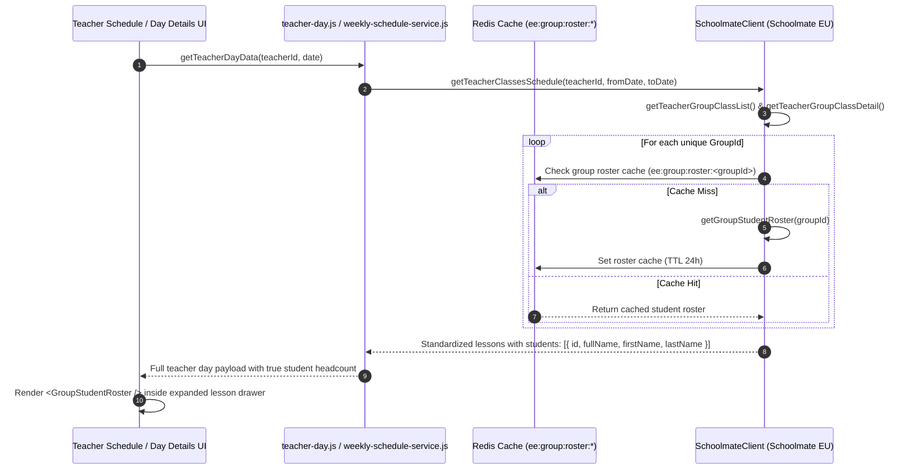
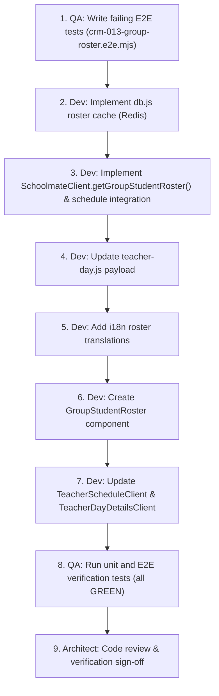

# Architecture: CRM-013 — Display Group Students Roster on Teacher and Day Pages

## Status

Ready

## Related documents

- Story: [CRM-013 — Display Group Students Roster on Teacher and Day Pages](../stories/CRM-013-display-group-students-roster-on-teacher-and-day-pages.md)
- UX specification: [UX: CRM-013 — Display Group Students Roster on Teacher and Day Pages](../ux/CRM-013-display-group-students-roster-on-teacher-and-day-pages.md)
- Related architectural decisions: [ADR-001 — Target Architecture and Module Boundaries](ADR-001-target-architecture-and-module-boundaries.md)
- PRD: [Schedule and Zoom Evidence Review](../PRD.md)

---

## Objective

Deliver an accurate, performant, and visual student roster integration for group and individual lessons across both the **Teacher Schedule** (`/teachers/[id]`) and **Teacher Day Details** (`/teachers/[id]/[date]`) pages:
1. Eliminate misleading duration-based capacity conflations (e.g. 90-minute lessons showing `Planned: 9` and unverified `Attended: 9/9`).
2. Retrieve authoritative enrolled student rosters from Schoolmate EU and enrich lesson domain payloads with accurate student records (`fullName`, `firstName`, `lastName`, `id`).
3. Render lightweight **Flow-Style Student Chips (Pill Badges)** in expanded lesson drawers, enabling side-by-side visual cross-referencing with Zoom meeting participants without vertical layout inflation.

---

## Requirements summary

### Functional requirements
1. **Schoolmate Group Roster Extraction**: Enrich group lessons with the true list of enrolled students fetched from Schoolmate (`/group/groupstudentlist` or `/group/getgroupdetails` / `/student/studentassignlist`).
2. **Accurate Enrolled Student Counts**: Replace duration-derived slot numbers with exact headcount (e.g., `GIZ Group 8 English Empire` displays `6 students`, `NovaPay A2+/2` displays `4 students`, individual lessons display `1 student`).
3. **Decouple False Aggregate Attendance**: Remove automatic `Attended: X/X` claims from lesson summary bars and cards when individual student attendance is not verified.
4. **Flow-Style Student Chips**: Render student names as inline wrapped chips inside the expanded drawer on both `/teachers/[id]` and `/teachers/[id]/[date]` views.
5. **Individual Lesson Support**: Preserve clean single-student rendering for 1-on-1 lessons (`cleanStudentName` with `1 student enrolled`).
6. **Localization**: Support English (`en`), Ukrainian (`uk`), and Polish (`pl`) locale strings for roster headers and student count badges.

### UX requirements
1. **Vertical Compactness**: Inline wrapped flex chips (`gap: 6px 8px`) keep the left column compact, maintaining vertical parity with the right column (Zoom evidence).
2. **Keyboard & Screen Reader Accessibility**: Semantic `<ul role="list">` and `<li role="listitem">` structure with proper `aria-expanded` and `aria-label` attributes.
3. **Responsive Flow**: Natural wrap across desktop (side-by-side 50/50), tablet, and mobile layouts.

### Non-functional requirements
1. **Performance & Caching**: Cache group rosters in Redis (`ee:group:roster:<groupId>`) with 24-hour TTL to prevent duplicate upstream calls to Schoolmate.
2. **Reliability & Resilience**: Wrap Schoolmate roster lookups in the existing exponential backoff and timeout mechanisms (`SchoolmateClient._requestAuthenticated`). If an individual group roster lookup fails, fallback gracefully to group title without failing the entire schedule response.
3. **Strict Boundaries**: Preserve vertical slice architecture established in CRM-008. Logic resides in `lib/infrastructure/schoolmate.js`, `lib/services/teacher-day.js`, and shared components.

---

## Existing implementation

### Verified Entry Points & Flow
- **Teacher Schedule View** (`ee-crm/app/teachers/[id]/TeacherScheduleClient.js`):
  - Fetches schedule from `/api/teachers/[id]` and Schoolmate reports.
  - Renders lesson accordion cards in `filteredLessons.map(...)`.
  - Currently renders `👥 Planned: ${lesson.enrolledStudents || 1}` and `Attended: ${attended}/${planned}` (lines 741–747).
  - Expanded drawer currently displays only `rawGroupName` and `enrolledStudents` count badge without student names (lines 757–784).
- **Teacher Day Details View** (`ee-crm/app/teachers/[id]/[date]/TeacherDayDetailsClient.js`):
  - Server route `ee-crm/app/teachers/[id]/[date]/page.js` calls `getTeacherDayData({ teacherId, date })`.
  - Client component renders Schoolmate column on left and Zoom column on right.
  - Lesson card drawer mirrors `TeacherScheduleClient.js` (lines 538–580).
- **Backend Service Layer** (`ee-crm/lib/services/teacher-day.js`):
  - `getTeacherDayData()` calls `SchoolmateClient.getTeacherClassesSchedule({ teacherId, fromDate, toDate })`.
  - Maps `dayLessons` into `schoolmateResult.lessons`.
- **Infrastructure Client** (`ee-crm/lib/infrastructure/schoolmate.js`):
  - `getTeacherClassesSchedule()` queries `/teacher/getteachergroupclasslist` and `/teacher/getteachergroupclassdetail`.
  - Previously derived `enrolledStudents` from scheduler slot count `SchedulerLessons.EnrolledStudents` (which was duration/10).

---

## Proposed solution

### Control and Data Flow



### Key Components of the Solution:
1. **Schoolmate Client Roster Fetcher**:
   - Introduce `getGroupStudentRoster({ groupId })` in `ee-crm/lib/infrastructure/schoolmate.js`.
   - Batch group roster queries concurrently during `getTeacherClassesSchedule` execution.
   - Enforce safe fallback: if group roster is empty or unavailable, fallback to empty array `students: []` and count `1` without breaking the schedule fetch.
2. **Redis Group Roster Caching**:
   - Cache key format: `ee:group:roster:<groupId>`.
   - Data structure: JSON serialized array of student records.
   - TTL: 86,400 seconds (24 hours).
3. **Domain Payload Structure**:
   ```typescript
   interface LessonStudent {
     id: number | string;
     fullName: string;
     firstName?: string;
     lastName?: string;
   }

   interface Lesson {
     id: string;
     groupLessonId: number;
     groupId: number;
     groupName: string;
     className: string;
     date: string;
     startTime: string | null;
     endTime: string | null;
     durationMinutes: number;
     enrolledStudents: number; // True headcount (e.g. 6 or 4)
     isIndividual: boolean;
     students: LessonStudent[]; // Enrolled student objects
     attendanceChecked: boolean;
     classDetailsAdded: boolean;
     teacherRate: string;
     lessonStatusName: string | null;
     lessonStatusColor: string | null;
   }
   ```
4. **Reusable UI Component (`GroupStudentRoster.js`)**:
   - Located at `ee-crm/app/components/GroupStudentRoster.js`.
   - Renders a flex container with `.student-chip` pills.
   - For 1-on-1 lessons, displays `Enrolled Student:` followed by single chip.
   - For group lessons, displays `Enrolled Students ({count}):` followed by wrapped chips.

---

## Architecture decisions

### ADR-013.1: Server-Side Batch Enrichment vs. Client-Side Lazy Fetching
- **Context**: Student rosters can be fetched either upfront on the server during schedule retrieval or lazily on demand when a user expands a specific lesson card.
- **Decision**: Enrich lessons on the server within `SchoolmateClient.getTeacherClassesSchedule` and `teacher-day.js`, backed by Redis roster caching.
- **Rationale**: 
  - Administrators frequently expand multiple lessons to perform rapid side-by-side cross-checks with Zoom meetings.
  - Upfront enrichment eliminates drawer opening latency and layout shifts.
  - Server-side caching in Redis ensures each group roster is only queried once across all teachers and sessions.
- **Tradeoffs**: Slightly larger initial JSON payload (approx. 1–2 KB extra per day), easily offset by zero client loading spinners.
- **Alternatives considered**: Client-side lazy `/api/groups/[id]/students` fetch — rejected due to async drawer delays and flickering during side-by-side review.

### ADR-013.2: Flow-Style Inline Chips vs. Table Rows
- **Context**: Displaying 6–12 students per group in traditional table rows takes 300px+ height, pushing the lesson card down and breaking side-by-side alignment with Zoom meetings on the right.
- **Decision**: Adopt inline wrapped pill badges (`.student-chip`) in a flex wrap container.
- **Rationale**:
  - Compresses 6–8 students into 2 compact rows (approx. 60px height).
  - Maximizes visual scanability against the Zoom participant list on the right.
  - Reuses CRM badge design system variables.
- **Tradeoffs**: Less space for secondary student metadata (e.g., student email or phone), which is out of scope for CRM-013.

---

## Change impact

### Frontend
- **`ee-crm/app/components/GroupStudentRoster.js`** (New): Reusable student chips roster component.
- **`ee-crm/app/teachers/[id]/TeacherScheduleClient.js`** (Update):
  - Remove `👥 Planned: X · Attended: X/X` from summary bar; display `⏱️ X min` and `👥 X students`.
  - Replace group row with `<GroupStudentRoster />` in expanded drawer.
- **`ee-crm/app/teachers/[id]/[date]/TeacherDayDetailsClient.js`** (Update):
  - Mirror summary bar cleanup and integrate `<GroupStudentRoster />`.
- **`ee-crm/lib/shared/i18n/translations.js`** (Update):
  - Add `roster` dictionary keys across `en`, `uk`, and `pl`.

### Backend & Services
- **`ee-crm/lib/infrastructure/schoolmate.js`** (Update):
  - Add `getGroupStudentRoster({ groupId })`.
  - Integrate roster fetching and headcount calculation into `getTeacherClassesSchedule()`.
- **`ee-crm/lib/infrastructure/db.js`** (Update):
  - Add `getGroupRosterCache(groupId)` and `setGroupRosterCache(groupId, students, ttl)`.
- **`ee-crm/lib/services/teacher-day.js`** (Update):
  - Pass enriched student rosters and accurate `enrolledStudents` headcount through `getTeacherDayData()`.

### API Contracts
- Lesson objects in `/api/teachers/[id]` and `getTeacherDayData` include:
  ```json
  {
    "enrolledStudents": 6,
    "isIndividual": false,
    "students": [
      { "id": 357155, "fullName": "Goncharov Andrii", "firstName": "Andrii", "lastName": "Goncharov" },
      { "id": 357156, "fullName": "Khyzhniak Valentyna", "firstName": "Valentyna", "lastName": "Khyzhniak" }
    ]
  }
  ```

### Data Model and Persistence
- Redis Key: `ee:group:roster:<groupId>` (stringified JSON array of student objects, TTL 86400s).

### Security and Privacy
- Endpoints use existing authenticated Schoolmate session.
- Student data exposed is strictly limited to names for roster verification.

### Observability
- Logger records `GROUP_ROSTER_FETCH` events and fallback warnings if an individual group roster fails.

---

## File-level implementation plan

### 1. `ee-crm/lib/infrastructure/db.js`
- **Existing responsibility**: Redis / In-Memory persistence for teachers, logs, and schedule caches.
- **Planned changes**:
  - Add `getGroupRosterCache(groupId)`: queries `ee:group:roster:<groupId>`.
  - Add `setGroupRosterCache(groupId, students, ttlSeconds = 86400)`: stores group roster in Redis with 24h expiration.
  - Support memoryStore fallback in development/test mode.
- **Dependencies**: `./redis.js`.

### 2. `ee-crm/lib/infrastructure/schoolmate.js`
- **Existing responsibility**: Direct HTTP client for Schoolmate EU API.
- **Planned changes**:
  - Add `getGroupStudentRoster({ groupId })` to fetch assigned students from Schoolmate.
  - In `getTeacherClassesSchedule()`, collect all unique `groupId`s and resolve their rosters via cache / API.
  - Assign `students: roster` and `enrolledStudents: roster.length` to each lesson item.
  - Set `isIndividual: roster.length <= 1`.
- **Dependencies**: `./db.js` (for roster caching).

### 3. `ee-crm/lib/services/teacher-day.js`
- **Existing responsibility**: Authoritative teacher-day evidence provider.
- **Planned changes**:
  - Ensure `getTeacherDayData()` maps `students`, `isIndividual`, and `enrolledStudents` from `cachedSchedule` into `dayLessons`.
- **Dependencies**: `../infrastructure/schoolmate.js`, `../infrastructure/db.js`.

### 4. `ee-crm/app/components/GroupStudentRoster.js` — new file
- **Responsibility**: Render flow-style student chips for expanded lesson drawers.
- **Planned contents**:
  - Semantic `<ul role="list">` container with flex wrap styling.
  - Mapping of `students` to `.student-chip` pills with user icon `👤` and name.
  - Distinct section labels for group vs. individual classes using `useLanguage()`.
  - Empty state note when roster is empty.
- **Dependencies**: `react`, `@/lib/shared/i18n/LanguageContext`.

### 5. `ee-crm/app/teachers/[id]/TeacherScheduleClient.js`
- **Existing responsibility**: Client component for weekly teacher schedule.
- **Planned changes**:
  - Replace duration-based `Planned: X` / `Attended: X/X` in summary bar with `⏱️ X min` and `👥 X students`.
  - Render `<GroupStudentRoster students={lesson.students} isIndividual={isIndividual} />` in expanded drawer.
- **Dependencies**: `@/app/components/GroupStudentRoster`.

### 6. `ee-crm/app/teachers/[id]/[date]/TeacherDayDetailsClient.js`
- **Existing responsibility**: Client component for daily teacher comparison view.
- **Planned changes**:
  - Update lesson summary bar and integrate `<GroupStudentRoster />` in expanded drawer.
- **Dependencies**: `@/app/components/GroupStudentRoster`.

### 7. `ee-crm/lib/shared/i18n/translations.js`
- **Existing responsibility**: Multi-language dictionary for `en`, `uk`, and `pl`.
- **Planned changes**:
  - Add `roster` namespace translations:
    - `enrolledStudents`: `'Enrolled Students ({count})'` / `'Зараховані учні ({count})'` / `'Zapisani studenci ({count})'`
    - `enrolledStudent`: `'Enrolled Student:'` / `'Зарахований учень:'` / `'Zapisany student:'`
    - `studentsCount`: `'{count} students'` / `'{count} учнів'` / `'{count} studentów'`
    - `noStudents`: `'No students enrolled'` / `'Немає зарахованих учнів'` / `'Brak zapisanych studentów'`
- **Dependencies**: None.

---

## Testing strategy

### Unit & Service tests (`test-crm-013.js`)
- Test `SchoolmateClient.getGroupStudentRoster()` mapping and error fallback.
- Test `db.getGroupRosterCache()` and `db.setGroupRosterCache()` with TTL.
- Test `getTeacherClassesSchedule()` integration: verifies `enrolledStudents` reflects roster length rather than duration.

### End-to-End & Acceptance tests (`verification/tests/crm-013-group-roster.e2e.mjs`)
- **Verification Target 1 — Teacher `t_0fa2ff7f` (GIZ Group 8)**:
  - URL: `/teachers/t_0fa2ff7f?from=2026-09-28&to=2026-10-04&preset=thisWeek`
  - Verifies header shows `6 students` (and NOT `Planned: 9` or `9/9 Attended`).
  - Verifies expanded drawer shows 6 student chips:
    1. `Goncharov Andrii`
    2. `Khyzhniak Valentyna`
    3. `Pynzaru Anastasiia`
    4. `Sytiuk Antonina`
    5. `Tsyberman Anastasiia`
    6. `Zahorodniuk Vira`
- **Verification Target 2 — Teacher `t_759a0536` (NovaPay A2+/2)**:
  - URL: `/teachers/t_759a0536?from=2026-09-28&to=2026-09-28`
  - Verifies header shows `4 students`.
  - Verifies expanded drawer shows 4 student chips:
    1. `Bevz Serhii`
    2. `Kozachuk Anna`
    3. `Riabokon Tetiana`
    4. `Yerunova Nataliia`
- **Verification Target 3 — Individual Lessons**:
  - Verifies 1-on-1 lessons display `1 student enrolled` with clean single chip.

Repository verification commands:
```bash
npm run test:crm-013
npm run test:crm-013:e2e
```

---

## Implementation sequence



---

## Compatibility, deployment, and rollback

- **Autonomous Execution**: Can run completely autonomously. No schema migrations, table creation, or manual credentials needed.
- **Rollback Strategy**: If Schoolmate roster endpoint experiences upstream degradation, the client falls back to empty roster `students: []` and default count `1`, maintaining previous schedule display without crashing.

---

## Risks and mitigations

| Risk | Impact | Likelihood | Mitigation |
|---|---|---:|---|
| Schoolmate group roster API latency for multiple groups | Med | Low | Cached in Redis with 24-hour TTL; batched concurrent requests. |
| Group has 0 assigned students in Schoolmate | Low | Low | Handled gracefully with `No students enrolled` empty state note. |
| Large groups (12+ students) causing chip overflow | Low | Low | Flex wrap container with `gap: 6px 8px` wraps cleanly across rows without fixed card heights. |

---

## Assumptions

1. Schoolmate group student roster returns authoritative student records with first and last names.
2. Group sizes typically range between 2 to 12 students, making flex wrap chips optimal for UI clarity.

---

## Open questions

| Question | Why it matters | Owner | Blocking |
|---|---|---|---|
| None | All functional requirements, endpoints, fixtures, and UX specs are verified. | Architect | No |

---

## Out of scope

- Per-student interactive attendance status marking (`✅/❌/❓` persistent toggles) — deferred to CRM-014.
- Navigating to individual student profile pages — deferred to future student CRM module.

---

## Requirements traceability

| Requirement or acceptance criterion | Planned implementation | Planned verification |
|---|---|---|
| Remove `Planned: 9` & `Attended: 9/9` aggregate badges | `TeacherScheduleClient.js` & `TeacherDayDetailsClient.js` | E2E assertions for absence of `Planned: 9` |
| Accurate group count badge (`6 students`, `4 students`) | `schoolmate.js` roster headcount mapping | E2E assertion on badge text |
| Enumerate student names as flow chips | `GroupStudentRoster.js` component | E2E assertion on all student name elements |
| GIZ Group 8 6 student names verified | `GroupStudentRoster.js` | Target Verification URL 1 test |
| NovaPay A2+/2 4 student names verified | `GroupStudentRoster.js` | Target Verification URL 2 test |
| 1-on-1 lessons layout preservation | `GroupStudentRoster.js` `isIndividual` branch | Target Verification URL 3 test |

---

## Readiness checklist

- [x] Story and UX specification were reviewed
- [x] Relevant code and similar implementations were inspected
- [x] Plan follows the current stack and repository conventions
- [x] Frontend, backend, API, data, security, and observability impacts are covered
- [x] UX states and accessibility are covered
- [x] File-level work and verification commands are identified
- [x] Deployment and rollback are addressed
- [x] Every acceptance criterion is traceable
- [x] Assumptions and questions are visible
- [x] Story, UX, and architecture links work
