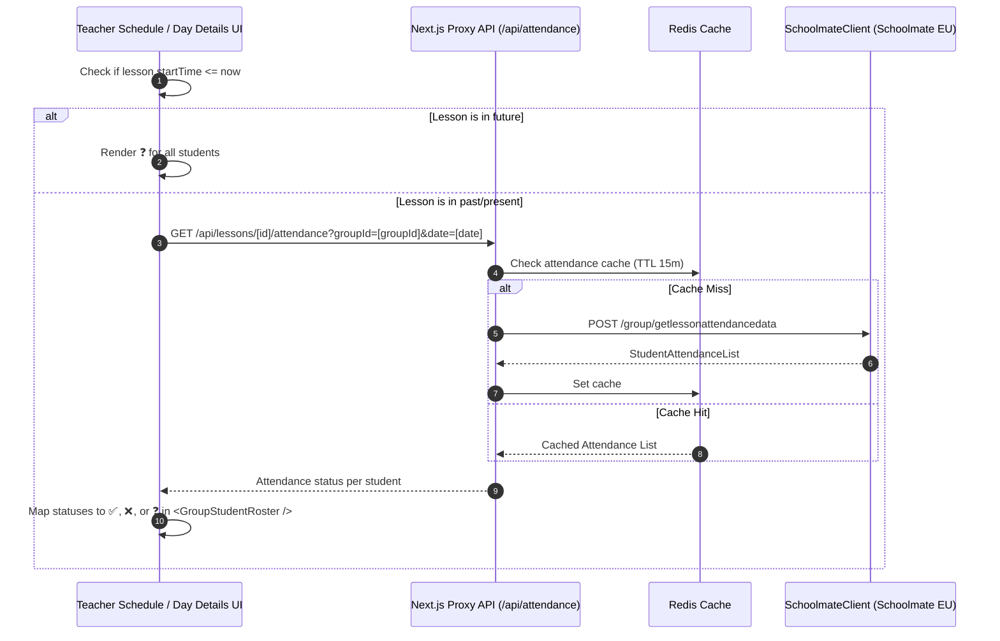

# Architecture: CRM-015 — Display Per-Student Attendance Status for Group Lessons

## Status

Ready

## Related documents

- Story: [CRM-015 — Display Per-Student Attendance Status for Group Lessons](../stories/CRM-015-display-per-student-attendance-status.md)
- Reference PRD: [Schedule and Zoom Evidence Review](../PRD.md)
- Related Architecture: [CRM-013 — Display Group Students Roster](CRM-013-display-group-students-roster-on-teacher-and-day-pages.md)
- API Request Fixture 1: `ee-crm/docs/stories/crm-015-halo-b15-request.md`
- API Request Fixture 2: `ee-crm/docs/stories/crm-015-profinstall-a2-request.md`

---

## Objective

Enhance the group student roster component introduced in CRM-013 by displaying real-time, per-student attendance status indicators (`✅` Present, `❌` Absent, `❓` Unchecked). This feature relies entirely on a proxy architecture against the Schoolmate EU API, ensuring that attendance data is fetched on-demand (and cached via Redis) without persisting into the EE-CRM database, and explicitly avoiding requests for future lessons.

---

## Operational Guidance

> [!IMPORTANT]
> **Proxy-Only Execution Mode**
> No database migrations are required for this story. The EE-CRM acts strictly as a presentation proxy for the Schoolmate `/group/getlessonattendancedata` endpoint. All caching happens in Redis and expires automatically.

---

## Requirements summary

### Functional requirements

1. **Schoolmate Attendance Proxying**: Fetch attendance for past/current group lessons via a new Schoolmate endpoint proxy (`/group/getlessonattendancedata`).
2. **Future Lesson Guard**: Implement a hard guard (`lesson.startTime <= now`) to skip fetching attendance for future lessons. Future lessons should default to the `❓` (Unchecked) state.
3. **Student Chip Icon Replacement**: Update `<GroupStudentRoster />` to map each student's attendance payload to the appropriate indicator (`✅`, `❌`, `❓`) instead of the generic `👤` icon.
4. **Aggregate Count Alignment**: Calculate and display the accurate "Attended" count in the lesson summary headers based on the fetched data.
5. **No DB Persistence**: Explicitly ensure attendance records are cached transiently (e.g., Upstash Redis) but not saved to Prisma/Postgres.

### UX requirements

1. **Indicator Icons**: Use standard emojis for clarity: `✅` (Present), `❌` (Absent), and `❓` (Unchecked).
2. **Accessibility**: Tooltips and `aria-label`/`title` attributes on each student chip must localized state names (e.g. "Present", "Absent", "Not marked").
3. **Graceful Degradation**: If the Schoolmate API errors or returns no data, silently fallback to `❓` (Unchecked) without breaking the UI.

### Non-functional requirements

1. **Performance**: Only fetch attendance when expanding the drawer, or prefetch it efficiently alongside the roster data. Redis caching with a short TTL (e.g., 10-15 minutes) should be used to prevent spamming Schoolmate for the same lesson.
2. **Proxy Security**: Ensure API proxy endpoints are protected by the same authentication layer as the rest of the application.

---

## Existing implementation

### Verified Entry Points & Flow
- **Teacher Schedule View** (`ee-crm/app/teachers/[id]/TeacherScheduleClient.js`): Renders expanded lesson drawer.
- **Teacher Day Details View** (`ee-crm/app/teachers/[id]/[date]/TeacherDayDetailsClient.js`): Also renders the expanded lesson drawer.
- **`GroupStudentRoster` Component** (`ee-crm/app/components/GroupStudentRoster.js`): Maps `students` array to `.student-chip` pills, currently hardcoded with the `👤` icon.
- **Schoolmate Client** (`ee-crm/lib/infrastructure/schoolmate.js`): Lacks the `/group/getlessonattendancedata` API wrapper.

---

## Proposed solution

### Control and Data Flow

---

## Architecture decisions

### ADR-015.1: Client-Side Fetching vs. Server-Side Pre-fetching for Attendance
- **Context**: Attendance data is required only when the lesson drawer is expanded or for calculating summary counts.
- **Decision**: Fetch attendance data dynamically via a new Next.js API route (`/api/lessons/[id]/attendance`) when the drawer is expanded (or parallelized with day data), cached heavily via Redis.
- **Rationale**: Keeps initial page load fast and avoids unnecessary upstream requests to Schoolmate for collapsed days/lessons.

### ADR-015.2: Proxy-Only (No DB Persistence)
- **Context**: The requirements explicitly state not to store student attendance in EE-CRM's DB.
- **Decision**: All attendance data requested from Schoolmate will be temporarily stored in Upstash Redis (with TTL) and never passed to a Prisma Postgres schema.
- **Rationale**: Schoolmate remains the sole source of truth for student attendance.

---

## Change impact

### Frontend
- **`ee-crm/app/components/GroupStudentRoster.js`** (Update):
  - Add logic to accept `attendanceData` map (keyed by `studentId`).
  - Replace `👤` with dynamic icons based on `attendanceData[student.id]`.
  - Add tooltips and `aria-label` for accessibility.
- **`ee-crm/app/teachers/[id]/TeacherScheduleClient.js`** & **`ee-crm/app/teachers/[id]/[date]/TeacherDayDetailsClient.js`** (Update):
  - Integrate fetching logic (e.g. SWR or simple fetch on expand) for lesson attendance.
  - Compute `X/Y Attended` summary string based on proxy data.

### Backend & Services
- **`ee-crm/lib/infrastructure/schoolmate.js`** (Update):
  - Add `getLessonAttendanceData({ groupId, fromDate, toDate })` using POST `/group/getlessonattendancedata`.
- **`ee-crm/app/api/lessons/[id]/attendance/route.js`** (New):
  - Proxy API route that validates session, checks Redis cache, calls `SchoolmateClient`, and normalizes the payload.
- **`ee-crm/lib/infrastructure/db.js`** (Update):
  - Add Redis getter/setter for lesson attendance caching.

---

## File-level implementation plan

### 1. `ee-crm/lib/infrastructure/schoolmate.js`
- **Planned changes**:
  - Add `getLessonAttendanceData({ groupId, fromDate, toDate })` to send a POST request with the required `lessonSearchModel` payload.

### 2. `ee-crm/lib/infrastructure/db.js`
- **Planned changes**:
  - Add `getLessonAttendanceCache(lessonId)` and `setLessonAttendanceCache(lessonId, data, ttl)`.

### 3. `ee-crm/app/api/lessons/[id]/attendance/route.js`
- **Responsibility**: Next.js App Router endpoint.
- **Planned contents**:
  - Authenticate user.
  - Return early if `startTime > now`.
  - Check `db.getLessonAttendanceCache()`.
  - On miss, call `schoolmate.getLessonAttendanceData()`.
  - Normalize payload into a simple map: `{ studentId: 'present' | 'absent' | 'unchecked' }`.
    - `short_name: null` / `attendance_status_color: null` -> `present` (`✅`)
    - `short_name: "AB"` / `attendance_status_color: "red"` -> `absent` (`❌`)
  - Set cache and return.

### 4. `ee-crm/app/components/GroupStudentRoster.js`
- **Planned changes**:
  - Accept `attendanceData` prop.
  - Map `attendanceData[student.id]` to `✅`, `❌`, or `❓`.
  - Apply corresponding accessible tooltips.

### 5. `ee-crm/app/teachers/[id]/TeacherScheduleClient.js` & `ee-crm/app/teachers/[id]/[date]/TeacherDayDetailsClient.js`
- **Planned changes**:
  - Fetch proxy route on component mount for past lessons (or on drawer expand).
  - Feed `attendanceData` into `GroupStudentRoster`.

---

## Implementation Verification Checks

*(Mapped exactly to CRM-015 Definition of Done)*

1. [ ] **Verify that the generic person icon (`👤`) on group student chips is replaced with `✅` (Present), `❌` (Absent), or `❓` (Unchecked) based on Schoolmate response data.**
2. [ ] **Verify that `short_name: null` / `attendance_status_color: null` maps to `✅` Present.**
3. [ ] **Verify that `short_name: "AB"` / `attendance_status_color: "red"` maps to `❌` Absent.**
4. [ ] **Verify that unrecorded or missing attendance records map to `❓` Unchecked.**
5. [ ] **Verify that no Schoolmate attendance API calls are made for future lessons (`startTime > now`).**
6. [ ] **Verify that per-student attendance records are not written to or stored in the EE-CRM database (proxy-only operation).**
7. [ ] **Verify that per-student attendance indicators render correctly on both `/teachers/[id]` (Teacher Schedule) and `/teachers/[id]/[date]` (Teacher Day Details) for all teachers and group lessons.**
