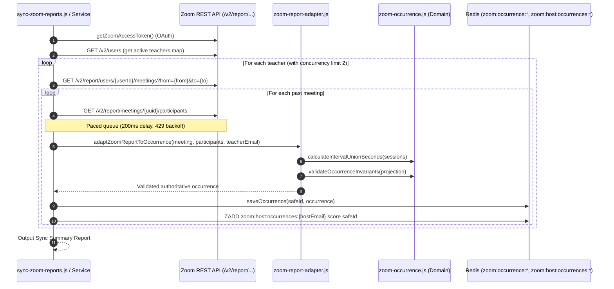
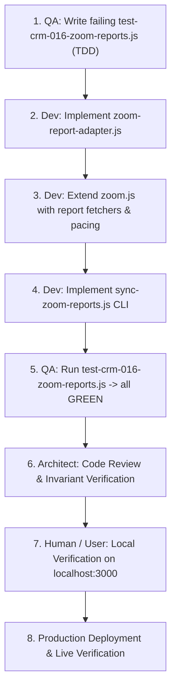

# Architecture: CRM-016 — Ingest Authoritative Zoom Telemetry via REST API Reports

## Status

Ready

## Related documents

- Story: [CRM-016 — Ingest Authoritative Zoom Telemetry via REST API Reports](../stories/CRM-016-ingest-zoom-telemetry-via-rest-api-reports.md)
- PRD: [Schedule and Zoom Evidence Review](../PRD.md)
- Related Architecture Decisions: [ADR-001 — Target Architecture and Module Boundaries](ADR-001-target-architecture-and-module-boundaries.md)
- Prior Stories: [CRM-001](../stories/CRM-001-display-tracked-zoom-meetings-on-teacher-page.md), [CRM-003](../stories/CRM-003-migrate-zoom-meetings-and-connect-webhook-ingestion.md), [CRM-005](../stories/CRM-005-complete-one-time-zoom-migration-and-independent-ingestion.md), [CRM-013](../stories/CRM-013-display-group-students-roster-on-teacher-and-day-pages.md)

---

## Objective

Deliver an authoritative, durable, and rate-safe Zoom meeting telemetry synchronization pipeline based on the **Zoom REST API Reports (`/v2/report/...`)**, eliminating reliance on fragile webhooks for historical and completed lesson attendance:
1. **Zero UI Impact:** Keep the UI layer (`TeacherScheduleClient.js`, `TeacherDayDetailsClient.js`, `GroupStudentRoster.js`) and presentation contracts completely untouched.
2. **Rate-Safe Queue & Pacing:** Implement rate-limiting request pacing (max 5–10 req/s, chunk concurrency 2, 200ms delay, and 429 backoff) to protect Zoom's API quota.
3. **Occurrence Schema Adaptation:** Convert raw Zoom Report API meeting and participant payloads directly into the authoritative occurrence schema (`zoom:occurrence:{safeId}`, `zoom:host:occurrences:{hostEmail}`), preserving session intervals, reconnects, and waiting-room distinctions (`in_meeting` vs `in_waiting_room`).
4. **Historical Sync CLI:** Provide `scripts/crm-016/sync-zoom-reports.js` (`npm run sync:zoom:reports`) allowing on-demand backfilling and testing across arbitrary date ranges (specifically verifying September 26–29, 2026).
5. **Local-First Verification:** Enforce end-to-end local testing and human stakeholder acceptance prior to any production deployment.

---

## Requirements summary

### Functional requirements
1. **Zoom Server-to-Server OAuth Authentication**:
   - Utilize existing environment variables (`ZOOM_ACCOUNT_ID`, `ZOOM_CLIENT_ID`, `ZOOM_CLIENT_SECRET`).
   - Reuse `getZoomAccessToken()` in `ee-crm/lib/infrastructure/zoom.js` with in-memory TTL caching.
2. **Zoom Report API Client & Pacing**:
   - `fetchPastMeetingsForUser({ zoomUserId, fromDate, toDate })`: Queries `GET /v2/report/users/{id}/meetings?type=past`.
   - `fetchMeetingParticipants({ meetingKey })`: Queries `GET /v2/report/meetings/{meetingKey}/participants`.
   - Pacing: Inter-request pacing to stay safely under Zoom limits (batch size 2 with 200ms delay; automatic 429 `Retry-After` retry).
3. **Data Adapter to Authoritative Occurrence**:
   - Maps Zoom Report API responses into the standard EE-CRM occurrence model:
     - Exact `uuid` as `occurrence_id`.
     - Start time, end time, and union duration in seconds (`duration * 60`).
     - Normalizes participants into canonical entities (`user_id`, `email`, `name`, `sessions`, `is_host`, `status`).
     - Aggregates multiple reconnect sessions without inflating elapsed durations.
     - Differentiates `status: "in_waiting_room"` from `status: "in_meeting"`.
   - Validates projections against `validateOccurrenceInvariants()`.
4. **Redis Persistence**:
   - Atomically stores occurrences under `zoom:occurrence:{safeId}`.
   - Updates `zoom:host:occurrences:{hostEmail}` sorted set by `score = start_time epoch ms`.
   - Strictly idempotent: re-syncing a date range does not duplicate records or mutate existing valid IDs.
5. **Teacher Mapping Resolution**:
   - Resolves Zoom host user IDs (`zoomUserId` / `zoom_user_id`) from DB teacher records or queries Zoom `/v2/users` to match teacher email.

### UX requirements
- **Strictly None (Zero UI Changes):** The presentation layer remains 100% identical. The UI components already consume `getZoomOccurrencesForTeacher`, which reads the exact same Redis keys.

### Non-functional requirements
1. **Reliability & Rate Limiting:** Must not trigger Zoom HTTP 429 rate limit errors. Must handle network errors with bounded retry.
2. **Isolation:** Changes are confined to `ee-crm/lib/infrastructure/` and `ee-crm/scripts/crm-016/`.
3. **Testability:** Fully testable locally using `InMemoryRedis` and mocked or recorded Zoom fixtures.

---

## Existing implementation

### Verified Entry Points & Files
- **Zoom Infrastructure** (`ee-crm/lib/infrastructure/zoom.js`):
  - Currently handles `getZoomAccessToken()`, `fetchUsersByStatus()`, `getZoomUsersSnapshot()` for CRM-012.
  - Exports `isZoomConfigured()`, `ZoomSourceError`.
- **Zoom Occurrence Domain** (`ee-crm/lib/domain/zoom-occurrence.js`):
  - Pure domain rules: `toSafeOccurrenceId`, `calculateIntervalUnionSeconds`, `validateOccurrenceInvariants`.
  - Functions must be reused for adapting Report API records into occurrences.
- **Persistence Layer** (`ee-crm/lib/infrastructure/redis.js` & `ee-crm/lib/infrastructure/zoom-occurrences.js`):
  - Keys: `zoom:occurrence:{safeId}`, `zoom:host:occurrences:{hostEmail}`.
  - Queries: `getZoomOccurrencesForTeacher({ teacherZoomEmail, fromDate, toDate })`.
  - Display formatting: `formatOccurrenceForDisplay(occ)`.
- **Teacher Schedule & Day Details** (`ee-crm/lib/services/teacher-day.js`, `ee-crm/app/teachers/[id]/[date]/page.js`):
  - `getTeacherDayData()` calls `getZoomOccurrencesForTeacher()` and formats with `formatOccurrenceForDisplay()`.

---

## Proposed solution

### Control and Data Flow



### Key Components of the Solution:

1. **Zoom Report API Client Extensions (`lib/infrastructure/zoom.js`)**:
   - `fetchTeacherPastMeetings({ userId, fromDate, toDate, token })`
   - `fetchMeetingParticipantsSafe({ meetingKey, token, maxRetries = 3 })`
   - Implements bounded concurrency (max 2 parallel calls) and rate-limit delay (200ms).

2. **Data Adapter Function (`lib/infrastructure/zoom-report-adapter.js`)**:
   - Accepts raw Zoom `meeting` and `participants` array.
   - Groups participants by email, user ID, or sanitized display name.
   - Deduplicates reconnect sessions:
     ```javascript
     {
       name: p.name,
       email: p.user_email || null,
       user_id: p.user_id ? String(p.user_id) : null,
       is_host: p.user_id === '16778240' || isHostEmailMatch,
       sessions: [{ join_time: p.join_time, leave_time: p.leave_time }],
       duration_seconds: p.duration,
       status: p.status // 'in_meeting' or 'in_waiting_room'
     }
     ```
   - Uses `calculateIntervalUnionSeconds` to calculate total participant connection time.
   - Builds complete occurrence object:
     ```javascript
     {
       occurrence_id: meeting.uuid,
       uuid: meeting.uuid,
       identity_kind: 'exact_uuid',
       numeric_meeting_id: String(meeting.id),
       topic: meeting.topic || 'Zoom Meeting',
       host_id: meeting.host_id,
       host_email: teacherEmail.toLowerCase().trim(),
       start_time: meeting.start_time,
       end_time: meeting.end_time,
       duration_seconds: (meeting.duration || 0) * 60,
       duration_state: 'complete',
       participants: participantsMap,
       revision: 1,
       source_updated_at: meeting.end_time || meeting.start_time
     }
     ```

3. **Standalone Sync CLI (`scripts/crm-016/sync-zoom-reports.js`)**:
   - Supports CLI flags: `--from`, `--to`, `--teacher`, `--dry-run`, `--execute`.
   - Connects to target Redis or InMemoryRedis.
   - Enforces batching, reporting, and non-blocking failure tolerance.

---

## Architecture decisions

### ADR-016.1: Direct Ingestion from Zoom REST Reports into Authoritative Occurrence Store
- **Context**: Zoom Webhooks are prone to drops, timeouts, and configuration drift. Zoom Report API provides the definitive historical truth from Zoom's cloud.
- **Decision**: Ingest past meetings and participant logs directly from Zoom's REST API into the existing `zoom:occurrence:{safeId}` and `zoom:host:occurrences:{hostEmail}` Redis data structure.
- **Rationale**: Completely bypasses webhook fragility while keeping 100% compatibility with existing query services (`getZoomOccurrencesForTeacher`) and UI components.
- **Tradeoffs**: Report data has a 15–30 min delay post-meeting (which is fully acceptable for administrative review).

### ADR-016.2: Client-Side Request Pacing and Concurrency Guard
- **Context**: Zoom Report API is a resource-intensive endpoint with rate limits (typically 30–60 requests per minute).
- **Decision**: Limit batch concurrency to 2, enforce 200ms inter-request delay, and implement automatic exponential backoff on HTTP 429 (`Retry-After`).
- **Rationale**: Prevents accidental rate-limiting or IP bans while syncing multiple teachers across multi-day date ranges.

### ADR-016.3: Strict Preservation of the UI Layer
- **Context**: The user explicitly requested that UI code not be altered.
- **Decision**: The UI layer (`app/teachers/...`) remains completely untouched. The new sync pipeline strictly feeds into the existing Redis schema and read contracts.
- **Rationale**: Guarantees zero frontend regression risk.

---

## Change impact

### Frontend
- **Zero changes.** All pages, components, CSS, and client hooks remain untouched.

### Backend & Infrastructure
- **`ee-crm/lib/infrastructure/zoom.js`** (Update):
  - Add `fetchTeacherPastMeetings()` and `fetchMeetingParticipantsSafe()`.
- **`ee-crm/lib/infrastructure/zoom-report-adapter.js`** (New):
  - Pure transformation function adapting Zoom API report items into authoritative occurrences.
- **`ee-crm/scripts/crm-016/sync-zoom-reports.js`** (New):
  - CLI execution script for manual, scheduled, or backfill sync.
- **`ee-crm/package.json`** (Update):
  - Add `"sync:zoom:reports": "node scripts/crm-016/sync-zoom-reports.js"`.

### Persistence
- Keys populated: `zoom:occurrence:{safeId}`, `zoom:host:occurrences:{hostEmail}`.

---

## File-level implementation plan

### 1. `ee-crm/lib/infrastructure/zoom.js`
- **Existing responsibility**: Zoom OAuth token management and user status snapshots.
- **Planned changes**:
  - Add `fetchTeacherPastMeetings({ token, userId, fromDate, toDate })`: calls `GET /v2/report/users/{userId}/meetings`.
  - Add `fetchMeetingParticipantsSafe({ token, meetingKey, maxRetries = 3 })`: calls `GET /v2/report/meetings/{meetingKey}/participants` with 429 backoff and 200ms pacing.
- **Dependencies**: Native `fetch`.

### 2. `ee-crm/lib/infrastructure/zoom-report-adapter.js` — new file
- **Responsibility**: Pure domain adapter transforming Zoom API report responses into valid EE-CRM occurrence records.
- **Planned contents**:
  - `adaptZoomReportToOccurrence(rawMeeting, rawParticipants, hostEmail)`:
    - Normalizes participant sessions, union durations, host flags, and waiting-room statuses.
    - Computes `toSafeOccurrenceId`.
    - Returns validated occurrence object.
- **Dependencies**: `../domain/zoom-occurrence.js`.

### 3. `ee-crm/scripts/crm-016/sync-zoom-reports.js` — new file
- **Responsibility**: Standalone idempotent sync script to pull reports from Zoom API and populate Redis.
- **Planned contents**:
  - CLI argument parsing (`--from`, `--to`, `--teacher`, `--dry-run`, `--execute`).
  - Fetches active teachers from Zoom/DB.
  - Queries meetings and participants with pacing.
  - Saves to Redis via `saveZoomOccurrence` / `publishOccurrenceProjection`.
  - Prints summary report.
- **Dependencies**: `dotenv`, `@upstash/redis`, `../../lib/infrastructure/zoom.js`, `../../lib/infrastructure/zoom-report-adapter.js`, `../../lib/infrastructure/redis.js`.

### 4. `ee-crm/test-crm-016-zoom-reports.js` — new file
- **Responsibility**: Automated test suite (written by QA before implementation) covering adapter logic, invariant validation, rate-limiting, and Redis querying.
- **Dependencies**: `node:assert`, `node:test`, `InMemoryRedis`.

---

## Implementation Verification Checks

### Check 1: Rate-Safe Zoom Report Client
- **Files to create/edit:** `ee-crm/lib/infrastructure/zoom.js`
- **Key functions/variables/types:** `fetchTeacherPastMeetings`, `fetchMeetingParticipantsSafe`, pacing queue/delay configuration.
- **Specific behavior to verify:** Functions must fetch past meetings and participants without throwing. Must enforce request throttling (max concurrency/pacing) and automatically handle HTTP 429 retries with exponential backoff.

### Check 2: Occurrence Adaptation & Invariant Compliance
- **Files to create/edit:** `ee-crm/lib/infrastructure/zoom-report-adapter.js`, `ee-crm/lib/domain/zoom-occurrence.js`
- **Key functions/variables/types:** `adaptZoomReportToOccurrence`, `calculateIntervalUnionSeconds`, `validateOccurrenceInvariants`.
- **Specific behavior to verify:** Adapts raw Zoom API report payload into authoritative occurrence schema. Merges reconnecting participant intervals via interval union. Captures waiting-room-only participants correctly (`status: 'in_waiting_room'`). Every occurrence must pass `validateOccurrenceInvariants`.

### Check 3: Query & Persistence Integrity in Redis
- **Files to create/edit:** `ee-crm/scripts/crm-016/sync-zoom-reports.js`, `ee-crm/lib/infrastructure/zoom-occurrences.js`
- **Key functions/variables/types:** `saveZoomOccurrence` / `publishOccurrenceProjection`, `getZoomOccurrencesForTeacher`.
- **Specific behavior to verify:** Synced occurrences must be written to `zoom:occurrence:{safeId}` and correctly indexed in `zoom:host:occurrences:{hostEmail}`. `getZoomOccurrencesForTeacher` must return occurrences chronologically. Syncing the same date range must be strictly idempotent.

### Check 4: Historical Target Dataset Verification
- **Files to create/edit:** Automated test suite or verification via CLI script `ee-crm/scripts/crm-016/sync-zoom-reports.js`.
- **Key functions/variables/types:** Date bounds `2026-09-26` to `2026-09-29`.
- **Specific behavior to verify:** Syncing the 26-29 Sep 2026 range restores exactly 9 meetings for Olha Kushnirchuk, 5 meetings for Yuliia Savchuk, and the target meetings for Irina Zhuravleva, including full participant records.

### Check 5: UI & End-to-End Contract Preservation
- **Files to create/edit:** `ee-crm/app/teachers/[id]/[date]/page.js`, `/api/teachers/[id]/days/[date]` (Verify untouched).
- **Key functions/variables/types:** `getTeacherDayData`, UI render components.
- **Specific behavior to verify:** `GET /api/teachers/[id]/days/[date]` returns `zoom.state: 'available'` with the expected payload. Day details page renders without errors and precisely zero UI modifications are made to achieve this.

---

## Implementation sequence



---

## Compatibility, deployment, and rollback

- **Autonomous Execution:** Can run completely autonomously locally.
- **Rollback Strategy:** If needed, synced records can be purged via a simple Redis delete of keys matching the sync run ID.
- **Zero UI Disruption:** Because UI contracts are identical, zero frontend regressions can occur.

---

## Risks and mitigations

| Risk | Impact | Likelihood | Mitigation |
|---|---|---:|---|
| Zoom API HTTP 429 Rate Limits | Med | Med | Paced queue (concurrency 2, 200ms delay, 429 exponential backoff). |
| Meeting UUID containing slashes (`/` or `+`) | Med | Low | Handled by `encodeURIComponent(encodeURIComponent(uuid))` as required by Zoom API. |
| Incomplete meetings (no end time) | Low | Low | Report API only returns `type=past` completed meetings; end time is always defined. |

---

## Requirements traceability

| Requirement or acceptance criterion | Planned implementation | Planned verification |
|---|---|---|
| Zoom Server-to-Server OAuth report calls | `lib/infrastructure/zoom.js` | Integration test in `test-crm-016-zoom-reports.js` |
| Request pacing and 429 backoff | `lib/infrastructure/zoom.js` | Rate limit scenario test |
| Occurrence schema adaptation & invariants | `lib/infrastructure/zoom-report-adapter.js` | Adapter invariant test |
| Redis occurrence & host indexing | `scripts/crm-016/sync-zoom-reports.js` | Query test via `getZoomOccurrencesForTeacher` |
| 28–29 Sep full participant restoration | `sync-zoom-reports.js` | Target verification test for Olha & Savchuk |
| Zero UI layer changes | `app/teachers/...` strictly untouched | Git diff inspection & Day details render check |

---

## Readiness checklist

- [x] Story and technical scope reviewed
- [x] Zoom Report API payload verified against live endpoints
- [x] Rate-limiting and pacing requirements specified
- [x] UI layer confirmed strictly untouched
- [x] TDD verification suite identified for QA
- [x] Quality gates and local-first verification workflow established
