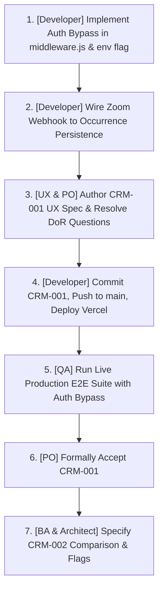

# EE-CRM Project Status

## Executive summary

Empire English CRM (EE-CRM) is in an active transition from an initial proof-of-concept (which coupled Schoolmate schedule scraping with placeholder Zoom telemetry) to an evidence-led administrative review platform specified in [PRD v1.2](file:///d:/2grow/poc-zoom-report/ee-crm/docs/PRD.md).

- **What is working:** The core Schoolmate synchronization pipeline ([`lib/schoolmate.js`](file:///d:/2grow/poc-zoom-report/ee-crm/lib/schoolmate.js), [`lib/pdf-parser.js`](file:///d:/2grow/poc-zoom-report/ee-crm/lib/pdf-parser.js)) is fast and robust, parsing live schedule data and class details in ~180ms. The teacher directory, multi-language internationalization (English, Ukrainian, Polish), and Google OAuth authentication are implemented. The foundational occurrence persistence layer ([`lib/zoom-occurrences.js`](file:///d:/2grow/poc-zoom-report/ee-crm/lib/zoom-occurrences.js)) and its 12 unit tests pass 100% locally.
- **What remains incomplete:** Live Zoom webhook ingestion ([`api/webhooks/zoom.js`](file:///d:/2grow/poc-zoom-report/api/webhooks/zoom.js)) still writes to legacy numeric-ID keys (`zoom:meeting:<id>`) and has **not** been wired to write occurrence records (`zoom:occurrence:<uuid>`). The teacher schedule page Zoom UI was rewritten locally to display factual occurrences, but remains uncommitted and untracked. Higher-level PRD requirements—teacher-day comparison, attention flags, the `/review` queue, the `/teachers/[id]/[date]` detail workspace, and administrative review notes—are documented but not implemented.
- **Important blockers and risks:** Production verification on Vercel is completely **blocked** because NextAuth middleware enforces Google OAuth on all application and API routes. The temporary authentication bypass (`NEXT_PUBLIC_EE_CRM_AUTH_BYPASS=true`) specified in [CRM-001](file:///d:/2grow/poc-zoom-report/ee-crm/docs/stories/CRM-001-display-tracked-zoom-meetings-on-teacher-page.md) has **not** been implemented in [`middleware.js`](file:///d:/2grow/poc-zoom-report/ee-crm/middleware.js), breaking all automated E2E test scripts. Additionally, the dedicated UX specification linked in CRM-001 is missing from the repository.
- **Recommended immediate focus:**
  1. Implement `NEXT_PUBLIC_EE_CRM_AUTH_BYPASS` in [`middleware.js`](file:///d:/2grow/poc-zoom-report/ee-crm/middleware.js) to unblock automated local and deployed testing.
  2. Wire Zoom webhook ingestion to write occurrence records to Redis, ensuring live data populates the new occurrence model.
  3. Create the missing CRM-001 UX specification, resolve open Definition of Ready questions, commit the local CRM-001 implementation, and deploy to Vercel.

---

## Overall assessment

- **Overall status:** At risk
- **Current milestone:** Milestone 1 / Delivery Increment 1 ([CRM-001](file:///d:/2grow/poc-zoom-report/ee-crm/docs/stories/CRM-001-display-tracked-zoom-meetings-on-teacher-page.md) — Display Tracked Zoom Meetings on Teacher Page)
- **Local application status:** Functional in development mode; unit and parser suites pass (100%); Next.js builds cleanly; integration E2E tests fail due to unhandled NextAuth redirection.
- **Vercel deployment status:** Operational at [https://poc-zom-report-2qvs.vercel.app/](https://poc-zom-report-2qvs.vercel.app/); health check confirms Upstash Redis and Schoolmate are connected; application UI and API routes are unreachable without manual Google OAuth login.
- **Authentication status:** Enforced globally via NextAuth Google provider; blocks automated QA and unauthorized verification; bypass mechanism not yet implemented.
- **Assessment date:** 26 September 2026
- **Evidence confidence:** High (verified via direct codebase inspection, local test execution, local server probe, git history analysis, and deployed Vercel HTTP inspection).

### Explanation of assessment

The project is classified as **At risk** rather than On track because:
1. **Zero stories meet the Definition of Done.** No feature can be verified in production due to the authentication wall.
2. **Local vs Deployed Divergence:** The code on `spike-gemini` contains substantial local untracked/uncommitted changes implementing CRM-001, whereas Vercel is running commit `8c12854` from `origin/main`, which still serves the old mock cards (`ONLY_HOST`, `VERIFIED`).
3. **Data Ingestion Gap:** The occurrence layer exists in isolation; incoming Zoom webhooks still use the legacy schema and do not populate occurrences.
4. **Traceability Break:** CRM-001 is formally in `Draft` status with missing UX documentation and unconfirmed business questions, yet implementation code was already written.

---

## Product scope

### Confirmed scope

According to [PRD v1.2](file:///d:/2grow/poc-zoom-report/ee-crm/docs/PRD.md) and [CRM-001](file:///d:/2grow/poc-zoom-report/ee-crm/docs/stories/CRM-001-display-tracked-zoom-meetings-on-teacher-page.md):
- **Core Purpose:** Administrative review workspace comparing Schoolmate reported lessons with occurrence-level Zoom evidence by teacher and school-local day (`Europe/Kyiv`).
- **Target User:** School administrator investigating discrepancies and recording follow-ups.
- **First Delivery Increment (CRM-001):**
  - UUID-scoped Zoom occurrence storage in Redis (`zoom:occurrence:<uuid>`).
  - Mathematical interval union for participant connected time (handling reconnects and concurrent multi-device logins without double-counting).
  - Duration state classification: `complete`, `incomplete`, and `unavailable`.
  - Date-range and teacher host email filtering for occurrences (`GET /api/teachers/[id]/zoom-meetings`).
  - Factual meeting list on teacher page replacing mocked cards, with expandable participant sessions.
  - Zero reconciliation tags, risk labels, fraud scores, or attendance verdicts in this increment.
  - Temporary auth bypass (`NEXT_PUBLIC_EE_CRM_AUTH_BYPASS=true`) for deployed E2E verification.
- **Broader Release Scope:**
  - Teacher-day day-level comparison (reported conducted lessons vs qualifying meetings $\ge 300\text{s}$ supported overlap).
  - Attention flags: Green (`Participation observed`, `Preliminary count match`), Yellow (`Count difference`, `Missing Zoom data`, `Teacher-only meeting`, `Brief guest attendance`, `Possible restart`, `Possible transition`, `Waiting-room outcome unknown`), Red (`Same public IP`, `Unresolved waiting-room attendance`).
  - Dedicated Teacher-Day Investigation Workspace at `/teachers/[teacherId]/[date]`.
  - Cross-Teacher Attention & Review Queue at `/review` with `Needs attention` and `Bookmarked` tabs.
  - Administrative review workflow: bookmarking, notes, statuses (`To review`, `Waiting for teacher`, `Resolved`), explanation logging, and snapshot change detection (`Updated since review`).

### Explicitly out of scope

Per [PRD v1.2 §1 & §16](file:///d:/2grow/poc-zoom-report/ee-crm/docs/PRD.md#L60-L70):
- Numerical risk scoring or definitive automated fraud verdicts.
- Automatic payroll withholding, compensation deductions, or rate overrides.
- Exact automatic assignment of Zoom meetings to individual Schoolmate lessons.
- Automatic splitting or merging of meeting instances into billable lessons.
- Enforcing minimum full-lesson delivery ratios or new school no-show waiting policies.
- Verifying individual student identities or matching students by email.
- Comparing individual Schoolmate student attendance marks against identified Zoom attendees.
- In-app messaging to teachers.

### Unclear or undocumented scope

1. **Role-Based Access Control (RBAC):** PRD §14 and UX doc §Users and permissions specify that viewing raw Zoom event payloads and public IP addresses must require a `sensitive-evidence` permission, and non-administrators should receive HTTP 403. However, NextAuth currently grants identical application access to any authenticated Google account; no roles or permissions schema exist.
2. **Teacher-to-Zoom Host Identity Rule:** CRM-001 Open Question 2 notes ambiguity regarding whether Zoom `host_id`, `host_email`, or a manual mapping table is authoritative when a teacher's email changes or differs from their Zoom account.
3. **Period Inclusion Boundary:** CRM-001 Open Question 1 notes uncertainty whether occurrences that started before the period but overlap it should be included, or only meetings whose start time falls within the period.
4. **Cross-Period & Midnight Crossings:** PRD §13 defines display on both days for midnight crossings, but the occurrence query implementation in `zoom-occurrences.js` currently indexes strictly by `start_time`.

---

## Delivery overview

| Area or epic | Total stories | Done | In progress | Blocked | Not started | Documentation only | Unknown |
|---|---:|---:|---:|---:|---:|---:|---:|
| **Foundational CRM Platform** | 7 | 0 | 1 | 0 | 0 | 0 | 6* |
| **Increment 1: Tracked Zoom Evidence (CRM-001)** | 1 | 0 | 1 | 0 | 0 | 0 | 0 |
| **Increment 2: Teacher-Day Comparison & Flags** | 1 | 0 | 0 | 0 | 0 | 1 | 0 |
| **Increment 3: Day Investigation Workspace** | 1 | 0 | 0 | 0 | 0 | 1 | 0 |
| **Increment 4: Review Queue & Workflow** | 2 | 0 | 0 | 0 | 0 | 2 | 0 |
| **Increment 5: Advanced Evidence & Heuristics** | 2 | 0 | 0 | 0 | 0 | 2 | 0 |
| **Test Automation & Auth Bypass** | 1 | 0 | 0 | 1 | 0 | 0 | 0 |
| **Total** | **15** | **0** | **2** | **1** | **0** | **6** | **6** |

*\*Note: 6 Foundational items are implemented locally and deployed, but their verified status is classified as `Implemented, not verified` (mapped to Unknown/Blocked for production acceptance) because NextAuth blocks automated E2E and unauthorized inspection on Vercel.*

---

## Story status

| Story ID / Item | Status | BA | UX | Architecture | Implementation | Local QA | Vercel QA | Main gap |
|---|---|---|---|---|---|---|---|---|
| **F-001: Schoolmate Client & Parser** | `Implemented, not verified` | ✅ | N/A | ✅ | ✅ | Pass | Blocked | Deployed verification blocked by Google OAuth |
| **F-002: Teacher Management API** | `In progress` | ✅ | N/A | ✅ | Partial | Fail (405) | Blocked | NextAuth intercepts test runner; no auth bypass |
| **F-003: Teacher Directory UI (`/`)** | `Implemented, not verified` | ✅ | ✅ | ✅ | ✅ | Pass | Blocked | Deployed UI unreachable without Google login |
| **F-004: Teacher Schedule UI (`/teachers/[id]`)** | `Implemented, not verified` | ✅ | ✅ | ✅ | ✅ | Pass | Blocked | Deployed page blocked by NextAuth |
| **F-005: System Logs (`/logs`, `/api/logs`)** | `Implemented, not verified` | ✅ | ✅ | ✅ | ✅ | Pass | Blocked | Deployed UI unreachable without Google login |
| **F-006: Internationalization (`/uk`, `/pl`)** | `Implemented, not verified` | ✅ | ✅ | ✅ | ✅ | Pass | Blocked | Deployed pages behind login (header only verified) |
| **F-007: NextAuth Authentication** | `Implemented, not verified` | ✅ | ✅ | ✅ | ✅ | Pass | Pass (Login UI) | Lacks E2E bypass flag; blocks all QA automation |
| **CRM-001: Display Tracked Zoom Meetings** | `Local only` | ⚠️ Draft | ❌ Missing | ✅ Approved | Partial | Pass (12/12) | Blocked | Webhook ingestion missing; code uncommitted |
| **CRM-002: Teacher-Day Comparison & Flags** | `Documentation only` | ✅ (PRD §6,10) | ✅ (UX doc) | ❌ | ❌ | None | None | Needs story breakdown and architecture ADR |
| **CRM-003: Day Detail Workspace (`.../[date]`)** | `Documentation only` | ✅ (PRD §5.C) | ✅ (UX doc) | ❌ | ❌ | None | None | Route does not exist; needs story & design |
| **CRM-004: Review Workflow, Notes & History** | `Documentation only` | ✅ (PRD §12) | ✅ (UX doc) | ❌ | ❌ | None | None | Needs persistence schema for review notes |
| **CRM-005: Cross-Teacher Queue (`/review`)** | `Documentation only` | ✅ (PRD §5.D) | ✅ (UX doc) | ❌ | ❌ | None | None | Route does not exist; needs story & API design |
| **CRM-006: Restart & Transition Heuristics** | `Documentation only` | ✅ (PRD §9) | ✅ (UX doc) | ❌ | ❌ | None | None | Exists only as exploratory spike; not in core |
| **CRM-007: Sensitive Evidence & IP RBAC** | `Blocked` | ⚠️ PRD §14 | ⚠️ Needs decision | ❌ | ❌ | None | None | Blocked on security/product decision for RBAC |
| **CRM-008: Auth Bypass for Automated E2E** | `Blocked` | ✅ | N/A | ✅ | ❌ | Fail | Blocked | Missing in `middleware.js`; blocks deployed QA |

---

## Story details

### CRM-001 — Display Tracked Zoom Meetings on the Teacher Page

- **Status:** `Local only` (Implementation complete locally; untracked/uncommitted; ingestion missing; deployed verification blocked)
- **Business value:** Gives administrators a trustworthy, factual view of Zoom meeting activity alongside Schoolmate schedules, eliminating false meeting inflation caused by permanent room ID collisions.
- **Evidence:**
  - Architecture ADR approved: [`docs/architecture/CRM-001-zoom-meeting-occurrence-architecture.md`](file:///d:/2grow/poc-zoom-report/ee-crm/docs/architecture/CRM-001-zoom-meeting-occurrence-architecture.md).
  - Core occurrence library implemented: [`lib/zoom-occurrences.js`](file:///d:/2grow/poc-zoom-report/ee-crm/lib/zoom-occurrences.js) (interval union, idempotency, date-range index).
  - API endpoint implemented: [`app/api/teachers/[id]/zoom-meetings/route.js`](file:///d:/2grow/poc-zoom-report/ee-crm/app/api/teachers/[id]/zoom-meetings/route.js).
  - Teacher page updated: [`app/teachers/[id]/page.js`](file:///d:/2grow/poc-zoom-report/ee-crm/app/teachers/[id]/page.js) renders factual occurrence cards and participant drawers.
  - Automated test suite passes 12/12: [`test-zoom-occurrences.js`](file:///d:/2grow/poc-zoom-report/ee-crm/test-zoom-occurrences.js).
- **Implemented:**
  - UUID occurrence keys: `zoom:occurrence:<uuid>`.
  - Date-range sorted set index: `zoom:occurrences:index` and host index `zoom:host:<email>:occurrences`.
  - Mathematical union for participant connected time without double-counting.
  - Factual UI with topic, numeric ID, duration states (`complete`, `incomplete`, `unavailable`), start/end times in Kyiv timezone, and participant session drawer.
  - Neutral empty state, skeleton loading, and retryable error state.
- **Missing:**
  - **Webhook Ingestion:** [`api/webhooks/zoom.js`](file:///d:/2grow/poc-zoom-report/api/webhooks/zoom.js) has not been updated to call `saveZoomOccurrence()`.
  - **Auth Bypass:** `NEXT_PUBLIC_EE_CRM_AUTH_BYPASS` is not handled in [`middleware.js`](file:///d:/2grow/poc-zoom-report/ee-crm/middleware.js).
  - **UX Spec:** Linked file `ee-crm/docs/ux/CRM-001-display-tracked-zoom-meetings-on-teacher-page.md` does not exist.
  - **Git & Deployment:** All CRM-001 code is uncommitted or untracked on branch `spike-gemini`; not merged to `main` or deployed to Vercel.
- **Local result:** All 12 unit and integration tests pass. Next.js production build succeeds.
- **Vercel result:** `Blocked`. Vercel runs commit `8c12854`, which contains old mock cards. Live verification cannot proceed without auth bypass.
- **Open questions:**
  1. Inclusion window: Should meetings spanning the boundary of the date range be included, or only those starting within it?
  2. Host mapping authority: How are email discrepancies between Schoolmate and Zoom resolved?
  3. Legacy backfill: Should existing numeric-ID records in Redis be migrated or retired?
- **Dependencies:** Webhook ingestion pipeline, NextAuth middleware bypass, resolution of DoR open questions.
- **Recommended next action:** Add auth bypass to middleware, update Zoom webhook to write occurrences, create missing UX spec, commit changes, and deploy.
- **Required owner:** Full-Stack Developer + UX Designer.
- **Priority:** P1.

---

### F-001 — Schoolmate Live Integration & PDF Vector Parser

- **Status:** `Implemented, not verified` (Fully verified locally; deployed verification blocked by NextAuth)
- **Business value:** Core data pipeline for teacher schedules, lesson counts, and compensation claim verification.
- **Evidence:**
  - [`lib/schoolmate.js`](file:///d:/2grow/poc-zoom-report/ee-crm/lib/schoolmate.js) implements pure Node.js HTTP authentication and schedule downloads in ~3s.
  - [`lib/pdf-parser.js`](file:///d:/2grow/poc-zoom-report/ee-crm/lib/pdf-parser.js) parses vector PDF in 188ms.
  - [`test-schoolmate.js`](file:///d:/2grow/poc-zoom-report/ee-crm/test-schoolmate.js) and [`test-parser.js`](file:///d:/2grow/poc-zoom-report/ee-crm/test-parser.js) pass 100%.
  - [`test-schoolmate-group-classes.mjs`](file:///d:/2grow/poc-zoom-report/ee-crm/test-schoolmate-group-classes.mjs) successfully extracts 19 group lessons with attendance and wage data.
  - Deployed health probe at `/api/health` reports `schoolmate: { configured: true }`.
- **Implemented:** Full authentication, session caching, schedule download, vector text extraction, lesson status and wage calculation.
- **Missing:** End-to-end automated verification against deployed Vercel endpoint `/api/schoolmate/report`.
- **Local result:** PASS.
- **Vercel result:** `Blocked` (requires Google login).
- **Open questions:** None.
- **Dependencies:** None.
- **Recommended next action:** Run deployed E2E test once auth bypass is available.
- **Required owner:** QA / Developer.
- **Priority:** P2.

---

### F-002 — Teacher Management CRUD & Synchronization

- **Status:** `In progress`
- **Business value:** Maintains teacher records, Schoolmate ID mappings, and Zoom host associations.
- **Evidence:**
  - [`app/api/teachers/route.js`](file:///d:/2grow/poc-zoom-report/ee-crm/app/api/teachers/route.js) and [`app/api/teachers/[id]/route.js`](file:///d:/2grow/poc-zoom-report/ee-crm/app/api/teachers/%5Bid%5D/route.js) implement CRUD.
  - [`app/api/schoolmate/sync-teachers/route.js`](file:///d:/2grow/poc-zoom-report/ee-crm/app/api/schoolmate/sync-teachers/route.js) syncs teachers with Schoolmate.
  - [`test-db.js`](file:///d:/2grow/poc-zoom-report/ee-crm/test-db.js) passes.
- **Implemented:** Teacher persistence in Redis, validation, Zoom invitation status enrichment, Schoolmate auto-sync.
- **Missing:** Automated test suite `test-api-routes.js` fails with HTTP 405 because NextAuth middleware redirects requests to `/login`.
- **Local result:** Unit tests pass; server-level API tests fail due to middleware.
- **Vercel result:** `Blocked` by Google OAuth.
- **Open questions:** None.
- **Dependencies:** NextAuth middleware bypass.
- **Recommended next action:** Fix test runner authentication handling or implement test bypass.
- **Required owner:** Developer.
- **Priority:** P1.

---

### CRM-002 — Teacher-Day Occurrence Comparison & Attention Flags

- **Status:** `Documentation only`
- **Business value:** Automatically flags count differences, teacher-only sessions, and suspicious shared-IP sessions, directing administrator focus to high-priority discrepancies.
- **Evidence:** Documented in [PRD v1.2 §6, §8, §10](file:///d:/2grow/poc-zoom-report/ee-crm/docs/PRD.md#L160-L308) and [UX Specification §Proposed user experience](file:///d:/2grow/poc-zoom-report/ee-crm/docs/ux/unassigned-schedule-zoom-evidence-review.md#L71-L96). Exploratory logic in `spike/reconciliation/engine.ts`.
- **Implemented:** None in `ee-crm`.
- **Missing:** Dedicated story specification, architecture ADR for flag persistence, day-level aggregation engine, and UI components.
- **Local result:** Not implemented.
- **Vercel result:** Not implemented.
- **Open questions:** Threshold consensus for "brief guest attendance" and handling of cross-midnight meetings.
- **Dependencies:** CRM-001 completion and Zoom webhook occurrence ingestion.
- **Recommended next action:** Formalize story CRM-002 and architecture ADR based on PRD §6 and §10.
- **Required owner:** Business Analyst + Architect.
- **Priority:** P1.

---

### CRM-003 — Dedicated Teacher-Day Investigation Workspace (`/teachers/[teacherId]/[date]`)

- **Status:** `Documentation only`
- **Business value:** Provides administrators with the space and tools needed to review detailed participant timelines, reconnects, and evidence without cluttering the overview.
- **Evidence:** Documented in [PRD v1.2 §5.C](file:///d:/2grow/poc-zoom-report/ee-crm/docs/PRD.md#L135-L149) and [UX Specification §Screens and components](file:///d:/2grow/poc-zoom-report/ee-crm/docs/ux/unassigned-schedule-zoom-evidence-review.md#L98-L150).
- **Implemented:** None. Route does not exist.
- **Missing:** Entire route, data loading hooks, layout, responsive design, and deep-linking structure.
- **Local result:** 404.
- **Vercel result:** 404.
- **Open questions:** Safe deep-link identifiers for meeting occurrences.
- **Dependencies:** CRM-001 and CRM-002.
- **Recommended next action:** Draft story specification and technical plan for the day-detail route.
- **Required owner:** Business Analyst + UX Designer.
- **Priority:** P2.

---

### CRM-004 — Administrative Review Workflow, Notes & Resolution History

- **Status:** `Documentation only`
- **Business value:** Retains institutional review knowledge across Schoolmate synchronizations, prevents duplicate investigations, and logs review reasons.
- **Evidence:** Documented in [PRD v1.2 §12](file:///d:/2grow/poc-zoom-report/ee-crm/docs/PRD.md#L326-L342) and [UX Specification](file:///d:/2grow/poc-zoom-report/ee-crm/docs/ux/unassigned-schedule-zoom-evidence-review.md).
- **Implemented:** None.
- **Missing:** Review schema in Redis (`ee:review:<teacherId>:<date>`), notes API, resolution dialog, snapshot hashing for `Updated since review`.
- **Local result:** Not implemented.
- **Vercel result:** Not implemented.
- **Open questions:** Concurrency handling for simultaneous admin edits.
- **Dependencies:** CRM-003.
- **Recommended next action:** Design persistence schema for review notes and snapshots.
- **Required owner:** Architect + Developer.
- **Priority:** P2.

---

### CRM-005 — Cross-Teacher Attention & Review Queue (`/review`)

- **Status:** `Documentation only`
- **Business value:** Enables an administrator to manage exceptions across the entire teaching staff from one prioritized queue rather than checking dozens of teachers individually.
- **Evidence:** Documented in [PRD v1.2 §5.D](file:///d:/2grow/poc-zoom-report/ee-crm/docs/PRD.md#L150-L159) and [UX Specification](file:///d:/2grow/poc-zoom-report/ee-crm/docs/ux/unassigned-schedule-zoom-evidence-review.md).
- **Implemented:** None. Route does not exist.
- **Missing:** `/review` page, global attention indexing in Redis, tabbed filtering (`Needs attention` vs `Bookmarked`), header badge count.
- **Local result:** 404.
- **Vercel result:** 404.
- **Open questions:** Query performance across large numbers of teachers.
- **Dependencies:** CRM-002 and CRM-004.
- **Recommended next action:** Draft story specification for `/review`.
- **Required owner:** Business Analyst.
- **Priority:** P2.

---

### CRM-008 — Authentication Bypass for Automated E2E Testing

- **Status:** `Blocked`
- **Business value:** Enables continuous automated E2E and regression testing across local, staging, and deployed Vercel environments without manual OAuth intervention.
- **Evidence:** Required by [CRM-001 §Functional Req 13-14 & Scenarios 10-11](file:///d:/2grow/poc-zoom-report/ee-crm/docs/stories/CRM-001-display-tracked-zoom-meetings-on-teacher-page.md#L50-L53).
- **Implemented:** Missing in [`ee-crm/middleware.js`](file:///d:/2grow/poc-zoom-report/ee-crm/middleware.js).
- **Missing:** Logic in middleware allowing requests when `process.env.NEXT_PUBLIC_EE_CRM_AUTH_BYPASS === 'true'`.
- **Local result:** Fails; NextAuth redirects all test calls.
- **Vercel result:** Fails; test suite `test-production-e2e.js` fails on Step 2.
- **Open questions:** None; explicitly authorized in CRM-001 audit trail.
- **Dependencies:** None.
- **Recommended next action:** Implement bypass condition in `middleware.js` and configure environment variable.
- **Required owner:** Developer.
- **Priority:** P0.

---

## Traceability gaps

| Story / Feature | Missing artifact or link | Impact | Required action | Owner |
|---|---|---|---|---|
| **CRM-001** | Missing UX document: `ee-crm/docs/ux/CRM-001-display-tracked-zoom-meetings-on-teacher-page.md` (currently 404) | Frontend was built from developer assumptions rather than approved UX design | Create and approve CRM-001 UX specification | UX Designer |
| **CRM-001** | Unresolved Definition of Ready in story (DoR items 4, 5, 6 unchecked; 5 open questions) | Risk of rework if period inclusion or host mapping rules change | Product Owner & BA signoff on DoR checklist | Product Owner / BA |
| **CRM-001** | Webhook ingestion architecture link broken | New occurrence storage layer is orphaned from live Zoom webhooks | Document webhook-to-occurrence mapping in ADR-CRM-001 | Architect |
| **CRM-002** (Comparison & Flags) | Missing story document in `docs/stories/` | Requirements exist only in PRD text; no acceptance criteria or subtasks | Create story document `CRM-002-day-level-comparison-and-flags.md` | Business Analyst |
| **CRM-003** (Day Details) | Missing story document in `docs/stories/` | No traceable engineering tasks for `/teachers/[id]/[date]` workspace | Create story document `CRM-003-teacher-day-detail-workspace.md` | Business Analyst |
| **CRM-004** (Review Workflow) | Missing architecture ADR for review state | No defined schema for note storage, review author, or snapshot hashing | Write ADR for review state persistence in Redis | Architect |
| **CRM-005** (Review Queue) | Missing story document in `docs/stories/` | No backlog entry for `/review` screen or global attention index | Create story document `CRM-005-admin-review-queue.md` | Business Analyst |
| **All Features** | Missing QA test plan under `ee-crm/docs/qa/` | No structured test matrix or QA signoff records exist | Establish QA documentation folder and test plans | QA Lead |

---

## Implementation gaps

| Gap | Affected story | Evidence | User impact | Priority | Owner |
|---|---|---|---|---|---|
| **Zoom Webhook Ingestion Not Wired to Occurrences** | CRM-001, PRD §2 | [`api/webhooks/zoom.js`](file:///d:/2grow/poc-zoom-report/api/webhooks/zoom.js) writes strictly to legacy `zoom:meeting:<id>`; does not call `saveZoomOccurrence` | Live Zoom meetings never appear in the new occurrence table | P0 | Full-Stack Developer |
| **Auth Bypass Missing in Middleware** | CRM-001, Testing | [`ee-crm/middleware.js`](file:///d:/2grow/poc-zoom-report/ee-crm/middleware.js) lacks `NEXT_PUBLIC_EE_CRM_AUTH_BYPASS` check | All automated E2E tests and production verifications are blocked | P0 | Full-Stack Developer |
| **CRM-001 Code Uncommitted & Untracked** | CRM-001 | `git status` shows 6 untracked files and 7 modified files on `spike-gemini` | Code exists only in working directory; cannot be reviewed, tested in CI, or deployed | P1 | Full-Stack Developer |
| **API Test Suite Blocked by Middleware** | F-002, CRM-001 | [`test-api-routes.js`](file:///d:/2grow/poc-zoom-report/ee-crm/test-api-routes.js) fails with HTTP 405 on POST `/api/teachers` | Local integration testing fails | P1 | Developer / QA |
| **Missing Role-Based Access Control (RBAC)** | PRD §14, Security | NextAuth allows any authenticated Google user; no admin or sensitive-evidence role check | Unrestricted access to teacher schedules; inability to safely gate IP evidence | P1 | Architect / Developer |
| **Teacher-Day Detail Route Missing** | CRM-003, PRD §5.C | Route `/teachers/[id]/[date]` does not exist in `app/` | Administrators cannot navigate to dedicated investigation workspace | P2 | Full-Stack Developer |
| **Admin Review Queue Route Missing** | CRM-005, PRD §5.D | Route `/review` does not exist in `app/` | No cross-teacher queue for attention flags or bookmarks | P2 | Full-Stack Developer |
| **Day Comparison Engine Missing** | CRM-002, PRD §6 | No day-level comparison logic in `ee-crm/lib` | Count comparisons and attention flags cannot be calculated | P2 | Full-Stack Developer |
| **Local Redis Credentials Missing** | All Features | `.env.local` lacks `UPSTASH_REDIS_*`; falls back to memory | Local test data lost on server restart; cannot test multi-instance Redis behavior locally | P3 | Developer |

---

## QA and deployment gaps

| Gap | Local status | Vercel status | Required action | Priority |
|---|---|---|---|---|
| **Automated E2E Suite Blocked** | Fails on API routes due to NextAuth redirect | Fails on Step 2 (`test-production-e2e.js`) due to `/login` redirect | Implement `NEXT_PUBLIC_EE_CRM_AUTH_BYPASS` in `middleware.js` and set env variable on Vercel | P0 |
| **CRM-001 Not Deployed** | Implemented, tests pass (12/12) | Not deployed (runs commit `8c12854` with mock UI) | Commit changes, push to `main`, verify Vercel build | P1 |
| **No Automated Webhook Tests for Occurrences** | Unit tests mock occurrence saves; no HTTP webhook test | Webhook handler does not write occurrences | Add occurrence ingestion test simulating live Zoom webhooks | P1 |
| **Legacy Challenger Suites Outdated** | `test-challenger-m1.js`, `test-adversarial-m1.js` fail due to auth | Untestable on Vercel | Update challenger tests to authenticate or use bypass | P2 |
| **No Structured QA Reports** | No `docs/qa/` directory exists | No QA deployment reports exist | Create QA documentation convention and record test runs | P2 |

---

## Local versus deployed

| Capability / Area | Repository / Local (`spike-gemini` working copy) | Deployed Vercel (`origin/main` commit `8c12854`) | Difference | Action Required |
|---|---|---|---|---|
| **Zoom Schedule Presentation** | Factual occurrence cards with topic, Kyiv timestamps, duration states, and participant drawer ([`app/teachers/[id]/page.js`](file:///d:/2grow/poc-zoom-report/ee-crm/app/teachers/%5Bid%5D/page.js)) | Mock cards displaying synthetic `ONLY_HOST ⚠️` and `VERIFIED` labels | Deployed version is outdated and contains obsolete mock labels | Commit and deploy local teacher page updates |
| **Zoom Meetings API** | `/api/teachers/[id]/zoom-meetings` implemented and tested | Endpoint does not exist (HTTP 404 / redirect) | Endpoint exists only locally | Commit and deploy route |
| **Occurrence Persistence Layer** | [`lib/zoom-occurrences.js`](file:///d:/2grow/poc-zoom-report/ee-crm/lib/zoom-occurrences.js) implemented with Redis indexing & in-memory fallback | Not deployed; only legacy `api/lib/redis.js` exists on Vercel | Occurrence layer is completely absent in production | Commit and deploy `lib/zoom-occurrences.js` |
| **Redis Persistence Mode** | In-memory fallback (`MemoryStore`) due to missing credentials in `.env.local` | Upstash Cloud Redis (`upstash_cloud`) connected and operational | Local data is ephemeral; deployed data is persistent | Add dev Upstash Redis credentials to `.env.local` if persistent local testing is needed |
| **Schoolmate Live Fetching** | Verified functional (~3s download, ~180ms parse) | Configured and connected according to `/api/health` | Identical configuration, but deployed UI is blocked by OAuth | Run E2E verification once auth bypass is deployed |
| **Authentication Enforcement** | Enforced by `middleware.js`; blocks local tests | Enforced by `middleware.js`; renders Google login page | Identical behavior; both lack E2E bypass | Implement bypass in `middleware.js` |

---

## Blockers and decisions

| Blocker or decision | Impact | Needed from | Blocking stories | Next action |
|---|---|---|---|---|
| **Automated E2E Auth Bypass** | Prevents verifying any deployed UI or API route without manual Google sign-in | Developer / Security | F-002, CRM-001, all future E2E tests | Implement `NEXT_PUBLIC_EE_CRM_AUTH_BYPASS` in `middleware.js` and set env variable |
| **Webhook Ingestion to Occurrence Schema** | Occurrence layer remains empty in production unless webhooks write to `zoom:occurrence:<uuid>` | Full-Stack Developer / Architect | CRM-001, CRM-002 | Update `api/webhooks/zoom.js` to dual-write or switch to occurrence persistence |
| **CRM-001 UX Specification Approval** | Developer implemented UI without an approved design artifact; link in story is broken | UX Designer | CRM-001 | Author `ee-crm/docs/ux/CRM-001-display-tracked-zoom-meetings-on-teacher-page.md` and sign off |
| **Role-Based Access Control (RBAC) Definition** | Cannot safely implement raw-event viewing or IP evidence gating per PRD §14 | Product Owner / Security | CRM-007, PRD §14 | Specify admin email allowlist or Google OAuth role claim schema |
| **Period Inclusion & Host Discrepancy Rules** | Edge cases in date boundaries and unmapped host emails remain unresolved | Product Owner | CRM-001, CRM-002 | Formalize decisions for CRM-001 Open Questions 1 & 2 |

---

## Risks

| Risk | Impact | Likelihood | Mitigation | Owner |
|---|---|---:|---|---|
| **Production Discrepancy / Drift** | Code developed on local branch diverges from `main`; risk of deployment surprises or regression | High | Commit CRM-001 to a clean feature branch, open PR to `main`, and verify Vercel preview deployment | Full-Stack Developer |
| **Silent Webhook Ingestion Failure** | If webhooks continue writing only to legacy keys, administrators will see an empty Zoom column in production | High | Add explicit integration test validating that a simulated Zoom webhook populates `zoom:occurrence:<uuid>` | Full-Stack Developer |
| **Security Risk via Auth Bypass** | If `NEXT_PUBLIC_EE_CRM_AUTH_BYPASS` is accidentally left enabled in production after testing, unauthorized users can view teacher schedules | Medium | Display a persistent high-contrast non-production banner when bypass is active; add automated check ensuring bypass is `false` before release | Architect / Developer |
| **Lack of RBAC on Sensitive Network Data** | Public IP addresses and raw webhook payloads could be exposed to non-admin staff | Medium | Do not expose IP fields or raw payloads until explicit authorization check is implemented | Product Owner / Developer |
| **Data Loss on Re-sync** | When Schoolmate data is refreshed, user notes or review states could be wiped if schema is not isolated | Low | Review records must use dedicated Redis namespace (`ee:review:*`) independent of cache keys | Architect |

---

## Recommended next work

### P0 — Immediate

1. **Implement E2E Authentication Bypass in `middleware.js`**
   - *Expected outcome:* Unauthenticated requests pass through when `NEXT_PUBLIC_EE_CRM_AUTH_BYPASS=true`, allowing local and deployed automated test suites to run.
   - *Reason for priority:* Complete blocker for all automated QA, CI/CD verification, and production validation.
   - *Dependencies:* None.
   - *Suggested owner:* Full-Stack Developer.
   - *Definition of completion:* `middleware.js` inspects the environment variable; automated test runner passes against local server; non-production banner displays when active.

2. **Wire Zoom Webhook Ingestion to Occurrence Storage**
   - *Expected outcome:* Inbound Zoom webhooks (`meeting.started`, `participant_joined`, `participant_left`, `meeting.ended`) create and update `zoom:occurrence:<uuid>` records in Redis.
   - *Reason for priority:* Critical data gap. Without this, live Zoom events do not reach the newly implemented occurrence model.
   - *Dependencies:* [`lib/zoom-occurrences.js`](file:///d:/2grow/poc-zoom-report/ee-crm/lib/zoom-occurrences.js).
   - *Suggested owner:* Backend Developer.
   - *Definition of completion:* Webhook handler saves occurrence records; integration test confirms a replayed webhook updates occurrence state without inflating durations.

---

### P1 — Next

1. **Author Missing UX Specification for CRM-001 & Resolve DoR Questions**
   - *Expected outcome:* Approved UX specification at [`ee-crm/docs/ux/CRM-001-display-tracked-zoom-meetings-on-teacher-page.md`](file:///d:/2grow/poc-zoom-report/ee-crm/docs/ux/CRM-001-display-tracked-zoom-meetings-on-teacher-page.md); open questions 1 & 2 resolved in story.
   - *Reason for priority:* Eliminates broken links and ensures implemented UI aligns with design intent before acceptance.
   - *Dependencies:* PRD v1.2.
   - *Suggested owner:* UX Designer + Product Owner.
   - *Definition of completion:* UX specification file exists, is linked from CRM-001, and matches the implemented card/drawer hierarchy.

2. **Commit CRM-001 Changes, Push to `main`, and Verify Production Deployment**
   - *Expected outcome:* CRM-001 implementation is merged to `main`, deployed to Vercel, and verified live.
   - *Reason for priority:* Replaces outdated mock telemetry cards in production with live factual Zoom occurrence data.
   - *Dependencies:* P0 items completed.
   - *Suggested owner:* Full-Stack Developer.
   - *Definition of completion:* Vercel build succeeds; `/api/teachers/[id]/zoom-meetings` returns HTTP 200 in production; teacher page renders live occurrence list.

3. **Break Down PRD v1.2 into Actionable Stories (CRM-002 through CRM-005)**
   - *Expected outcome:* Formal story documents in `ee-crm/docs/stories/` for Day Comparison & Flags (CRM-002), Day Detail Workspace (CRM-003), Review Notes & Workflow (CRM-004), and Review Queue (CRM-005).
   - *Reason for priority:* Enables team to proceed with core reconciliation features without ambiguity.
   - *Dependencies:* PRD v1.2.
   - *Suggested owner:* Business Analyst.
   - *Definition of completion:* Stories contain user story, business rules, acceptance criteria, and Definition of Ready.

---

### P2 — Important

1. **Define and Implement RBAC for Sensitive Evidence**
   - *Expected outcome:* Administrator authorization check implemented; public IP and raw event viewing restricted to authorized roles.
   - *Reason for priority:* Required by PRD §14 before raw event and IP features can be released.
   - *Dependencies:* NextAuth configuration.
   - *Suggested owner:* Architect / Product Owner.
   - *Definition of completion:* Authorization middleware returns HTTP 403 for unauthorized users requesting IP evidence.

2. **Establish QA Documentation and Test Matrix under `ee-crm/docs/qa/`**
   - *Expected outcome:* Centralized QA test plans, test matrices, and execution logs.
   - *Reason for priority:* Eliminates QA documentation gap and creates verifiable audit trail for releases.
   - *Dependencies:* None.
   - *Suggested owner:* QA Lead.
   - *Definition of completion:* `ee-crm/docs/qa/` created with test scenarios matching PRD §15 acceptance criteria.

---

### P3 — Later

1. **Add Upstash Redis Dev Credentials to `.env.local`**
   - *Expected outcome:* Local development connects to a cloud or local Redis instance instead of in-memory fallback.
   - *Reason for priority:* Convenience for persisting local test data across server restarts.
   - *Dependencies:* Redis database instance.
   - *Suggested owner:* Developer.
   - *Definition of completion:* Local dev health probe returns `mode: "upstash_cloud"`.

---

## Proposed execution sequence

1. **`[Developer]` — Implement Auth Bypass in `middleware.js`**
   - Unblocks local API tests and deployed E2E verification.
2. **`[Developer]` — Update Zoom Webhook to Ingest Occurrences**
   - Ensures production webhooks write to `zoom:occurrence:<uuid>`.
3. **`[UX & PO]` — Create CRM-001 UX Document and Resolve DoR**
   - Closes traceability gaps and establishes official acceptance criteria.
4. **`[Developer]` — Commit, Push to `main`, and Trigger Vercel Build**
   - Deploys CRM-001 to production environment.
5. **`[QA]` — Run Live Production E2E Suite (`test-production-e2e.js`)**
   - Verifies deployed behavior against acceptance criteria.
6. **`[Product Owner]` — Review Deployed Behavior and Formally Accept CRM-001**
   - Completes Milestone 1.
7. **`[BA & Architect]` — Finalize CRM-002 Story and Architecture ADR**
   - Unblocks development of the comparison and flag engine.

---

## Acceptance candidates

| Story | Evidence | Remaining PO decision |
|---|---|---|
| **CRM-001: Display Tracked Zoom Meetings** | Local unit suite passes 12/12; Next.js builds cleanly; factual UI replaces mock cards | Must resolve DoR open questions, confirm UX specification, wire webhook ingestion, and verify on Vercel with auth bypass |

---

## Items requiring revalidation

The following items **must be retested** immediately after `NEXT_PUBLIC_EE_CRM_AUTH_BYPASS` is deployed to Vercel:

1. **GET `/` (Teacher Directory):** Confirm table renders full teacher list, Schoolmate sync button, and weekly lessons badge.
2. **GET `/api/teachers`:** Confirm JSON list of teachers returns HTTP 200.
3. **POST `/api/schoolmate/report`:** Confirm live schedule PDF fetch and parse for test teacher `Savchuk Yuliia` (17251).
4. **GET `/api/teachers/[id]/zoom-meetings`:** Confirm endpoint returns valid JSON with tracked occurrences.
5. **GET `/teachers/[id]` (Teacher Schedule Page):** Confirm split view renders Schoolmate schedule on the left and live occurrence cards on the right without mock labels.
6. **GET `/api/logs` & `/logs`:** Confirm application audit logs render execution times and status codes.
7. **`test-production-e2e.js` Execution:** Run complete 10-step E2E verification script against `https://poc-zom-report-2qvs.vercel.app/` and confirm 100% pass.

---

## Unknowns

| Item | What was inspected | Why it is unknown | Evidence needed |
|---|---|---|---|
| **Live Deployed Schedule Page Behavior** | Vercel HTTP response for `/teachers/[id]` | Blocked by NextAuth Google OAuth redirect | Re-probe after auth bypass flag is set on Vercel |
| **Live Webhook Production Volume & Frequency** | Redis keys on Upstash Cloud via health probe | Health check returns connectivity status but does not expose key counts or event traffic | Redis telemetry metrics or Upstash console inspection |
| **Production Teacher Zoom Host Mapping Completeness** | `GET /api/teachers` locally (1 teacher) | Cannot inspect full production teacher directory on Vercel due to auth | Query production `/api/teachers` with auth bypass |

---

## Final recommendation

1. **Where EE-CRM currently stands:** EE-CRM has a solid architectural core and a proven Schoolmate integration. Increment 1 ([CRM-001](file:///d:/2grow/poc-zoom-report/ee-crm/docs/stories/CRM-001-display-tracked-zoom-meetings-on-teacher-page.md)) is technically implemented in the local working copy, but is not deployed, lacks live webhook wiring, and cannot be verified in production due to authentication blocking.
2. **Whether the current milestone is achievable:** Yes, the current milestone (CRM-001) is achievable within 1–2 working days once the developer wires the webhook handler, adds the auth bypass flag, and commits the work.
3. **The most important missing outcome:** A working end-to-end pipeline where live Zoom webhooks are stored as distinct UUID occurrences and displayed on the deployed Vercel teacher page.
4. **The next three actions the team should take:**
   1. `[Developer]` Add `NEXT_PUBLIC_EE_CRM_AUTH_BYPASS` to [`ee-crm/middleware.js`](file:///d:/2grow/poc-zoom-report/ee-crm/middleware.js) and enable it on Vercel.
   2. `[Developer]` Connect [`api/webhooks/zoom.js`](file:///d:/2grow/poc-zoom-report/api/webhooks/zoom.js) to [`lib/zoom-occurrences.js`](file:///d:/2grow/poc-zoom-report/ee-crm/lib/zoom-occurrences.js) so live webhooks write occurrence records.
   3. `[UX & BA]` Create [`ee-crm/docs/ux/CRM-001-display-tracked-zoom-meetings-on-teacher-page.md`](file:///d:/2grow/poc-zoom-report/ee-crm/docs/ux/CRM-001-display-tracked-zoom-meetings-on-teacher-page.md) to close the missing UX spec link and sign off on the Definition of Ready.
