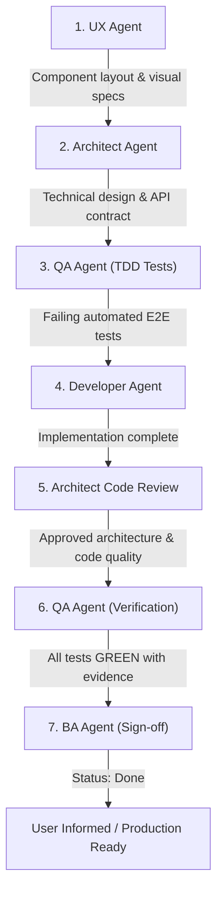

# CRM-013 — Display Group Students Roster on Teacher and Day Pages

**Story ID:** CRM-013  
**Status:** Ready  
**Primary user:** School administrator / Academic manager  
**Related PRD:** [Schedule and Zoom Evidence Review](../PRD.md)  
**Related UX Spec:** [UX: CRM-013 — Display Group Students Roster on Teacher and Day Pages](../ux/CRM-013-display-group-students-roster-on-teacher-and-day-pages.md)  
**Related Architecture Plan:** [Architecture: CRM-013 — Display Group Students Roster on Teacher and Day Pages](../architecture/CRM-013-display-group-students-roster-on-teacher-and-day-pages.md)  
**Related Reference Specs:**
- [All Groups Reference](../stories/groups_students/all_groups.md)
- [Group Student List Reference](../stories/groups_students/groups_student_list.md)

---

## 1. Summary & Problem Context

In the current version of the Teacher Schedule page (`/teachers/[id]`) and Teacher Day Details page (`/teachers/[id]/[date]`), group lessons display confusing and inaccurate attendance/capacity counts:
- For example, for the group **GIZ Group 8 English Empire** (a 90-minute lesson), the interface displays:
  - Header: `Planned: 9 · Attended: 9/9`
  - Expanded drawer: `9 students planned` and `9/9 Attended`
- In reality, the number **9** was derived from lesson duration (90 minutes / 10-minute units) rather than student headcount. Schoolmate records show that **GIZ Group 8 English Empire** actually consists of **6 students**.
- Furthermore, expanding the card only shows the group title, without listing who the actual enrolled students are.

This story replaces misleading duration-based student counters with the **actual list of enrolled students** from Schoolmate inside the expanded lesson drawer on the left side, directly facilitating comparison with the Zoom participants shown on the right side.

---

## 2. Business Objective & Value

- **Trustworthy Rosters:** Present the true roster size and student names for every group lesson.
- **Side-by-Side Verification:** Enable administrators to visually compare enrolled group students on the left with Zoom meeting attendees on the right.
- **Preparation for Attendance Tracking:** Lay the foundation for a future story that will attach per-student attendance marks (`✅` attended, `❌` absent, `❓` unmarked).

---

## 3. Workflow & How It Changes

| Aspect | Current Workflow | Target Workflow (CRM-013) |
|---|---|---|
| **Lesson Header Badge** | Displays misleading `Planned: 9 · Attended: 9/9` (conflating duration with headcount). | Removed misleading aggregate attendance and duration-as-student count text. Header displays lesson duration (`⏱️ 90 min`), time range, and rate tags. |
| **Expanded Drawer Content** | Displays generic group name with badge `9 students planned` / `9/9 Attended`. | Displays the group roster header (e.g. `6 students enrolled`) and enumerates each student's full name. |
| **Zoom Comparison** | Administrator sees Zoom participants on the right, but cannot see who belongs to the group on the left. | Administrator sees exact student names on the left and Zoom participant names on the right for clear visual matching. |
| **Attendance State** | Falsely marks entire group `9/9 Attended` automatically without checking individual records. | Decoupled aggregate attendance claims. Prepares slot for per-student attendance indicators in the next story. |

---

## 4. User Story

As a school administrator,  
I want to expand a scheduled group lesson on the teacher schedule and day details pages to see the list of actual enrolled students from Schoolmate,  
so that I can verify who is in the group and compare them with the Zoom meeting participants without seeing misleading duration-based student counts.

---

## 5. Visual References & Fixtures

### Reference Screenshots Provided by Product:
1. **Screenshot 1 (Current Issue):** Teacher Day view for Monday (`28/09/2026`) showing lesson `3. GIZ Group 8 English Empire` displaying misleading `Planned: 9 · Attended: 9/9` and `9 students planned`.
2. **Screenshot 2 (Schoolmate Truth):** Schoolmate group view confirming `GIZ Group 8 English Empire` has `Number of currently assigned students: 6`.
3. **Screenshot 3 (Student Names for GIZ Group 8):**
   - `Goncharov Andrii`
   - `Khyzhniak Valentyna`
   - `Pynzaru Anastasiia`
   - `Sytiuk Antonina`
   - `Tsyberman Anastasiia`
   - `Zahorodniuk Vira`
4. **Screenshot 4 (Student Names for NovaPay A2+/2):**
   - `Bevz Serhii`
   - `Kozachuk Anna`
   - `Riabokon Tetiana`
   - `Yerunova Nataliia`

---

## 6. Functional Requirements

1. **Remove Aggregate/Misleading Attendance Badges:**
   - Remove `👥 Planned: X · Attended: X/X` text from the lesson summary header when based on duration or unverified data.
   - Remove `X students planned` and `X/X Attended` aggregate chips from the expanded group card.
2. **Retrieve Group Students Roster:**
   - Fetch assigned student lists for groups from Schoolmate (via `groups_student_list` request endpoint).
3. **Render Group Student Names in Expanded Drawer:**
   - Enumerate all assigned students with their full names.
   - Display correct enrolled student count (e.g., `6 students enrolled` or `4 students enrolled`).
   - For individual (1-on-1) lessons, retain clean display of the single student's name.
4. **Page Consistency:**
   - Apply identically across:
     - Teacher Schedule View: `/teachers/[id]`
     - Teacher Day Details View: `/teachers/[id]/[date]`

---

## 7. Acceptance Criteria & Verification Checks

### Check 1: Target Verification URL 1 — Teacher `t_0fa2ff7f` (GIZ Group 8)
- **URL:** `https://poc-zom-report-2qvs.vercel.app/teachers/t_0fa2ff7f?from=2026-09-28&to=2026-10-04&preset=thisWeek`
- **Group:** `GIZ Group 8 English Empire` (15:00 – 16:30)
- **Checks:**
  - [ ] Does **NOT** display `Planned: 9` or `9 students planned` or `9/9 Attended`.
  - [ ] Displays count badge: `6 students enrolled` (or localized `6 учнів`).
  - [ ] Displays exactly the 6 student names:
    1. `Goncharov Andrii`
    2. `Khyzhniak Valentyna`
    3. `Pynzaru Anastasiia`
    4. `Sytiuk Antonina`
    5. `Tsyberman Anastasiia`
    6. `Zahorodniuk Vira`

### Check 2: Target Verification URL 2 — Teacher `t_759a0536` (NovaPay A2+/2)
- **URL:** `https://poc-zom-report-2qvs.vercel.app/teachers/t_759a0536?from=2026-09-28&to=2026-09-28`
- **Group:** `NovaPay A2+/2`
- **Checks:**
  - [ ] Displays count badge: `4 students enrolled` (or localized `4 учні`).
  - [ ] Displays exactly the 4 student names:
    1. `Bevz Serhii`
    2. `Kozachuk Anna`
    3. `Riabokon Tetiana`
    4. `Yerunova Nataliia`

### Check 3: Individual Lessons Preservation
- **Check:** 1-on-1 lessons (e.g. `Natalya Nosanenko GSK Eng`) continue to show `1 student enrolled` with the student's name without breaking layout.

### Check 4: Zoom Comparison
- **Check:** On the Day view, expanding the group lesson on the left column renders the student names adjacent to the Tracked Zoom meetings column on the right.

---

## 8. Multi-Agent Execution Flow

1. **UX Agent:** Plans component display and layout for the student roster in the expanded lesson card drawer based on Screenshot 1.
2. **Architect Agent:** Specifies technical plan (Schoolmate API integration, caching, data model, component architecture).
3. **QA Agent (TDD):** Writes automated verification tests for the two URLs (`t_0fa2ff7f` for `GIZ Group 8 English Empire` and `t_759a0536` for `NovaPay A2+/2`). Runs tests to confirm they fail initially.
4. **Developer Agent:** Implements the feature according to the Architect plan and validates against QA tests.
5. **Architect Code Review:** Reviews implementation against vertical-slice standards and performance requirements.
6. **QA Agent (Final Verification):** Runs test suite and verification tests locally and on Vercel preview; captures evidence.
7. **BA Agent:** Reviews verification report against acceptance criteria and marks CRM-013 as **Done**.

---

## 9. Definition of Ready Checklist

- [x] Business objective and primary user clear
- [x] Problem statement (duration vs. student count conflation) defined
- [x] Target fixtures and student names explicitly documented
- [x] Acceptance criteria and verification checks defined
- [x] Execution flow across agent roles specified
- [x] Out-of-scope boundaries (individual attendance marks `✅/❌/❓` deferred to next story) established

---

## 10. Audit Trail

| Date | Decision |
|---|---|
| 29 September 2026 | Created CRM-013 to display real group student rosters in teacher schedule and day details, removing confusing duration-derived attendance counters. |
| 29 September 2026 | Confirmed test datasets: `GIZ Group 8 English Empire` (6 students for teacher `t_0fa2ff7f`) and `NovaPay A2+/2` (4 students for teacher `t_759a0536`). |
| 29 September 2026 | Formulated multi-agent execution pipeline: UX -> Architect -> QA (failing TDD) -> Dev -> Arch Review -> QA (passing verification) -> BA sign-off. |
| 29 September 2026 | Decoupled individual attendance marking (`✅`, `❌`, `❓`) to a dedicated follow-up story. |
| 29 September 2026 | Completed UX spec proposing inline Flow-Style Student Chips (Pill Badges) in expanded lesson drawer instead of table rows for compact side-by-side scanning with Zoom participants. |
| 29 September 2026 | Completed Technical Architecture Plan specifying Schoolmate group roster retrieval, Redis 24h caching, domain payload enrichment, and reusable `GroupStudentRoster` component. |

---

## 11. Technical Implementation

The detailed architecture and implementation plan is documented in:
[Architecture: CRM-013 — Display Group Students Roster on Teacher and Day Pages](../architecture/CRM-013-display-group-students-roster-on-teacher-and-day-pages.md).
