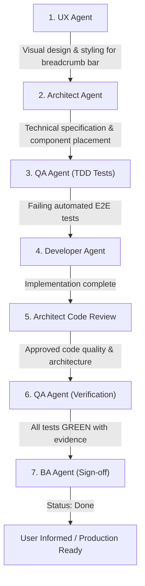

# CRM-014 — Add Breadcrumb Navigation Across EE-CRM Pages

**Story ID:** CRM-014  
**Status:** Ready  
**Primary user:** School administrator / Academic manager  
**Related PRD:** [Schedule and Zoom Evidence Review](../PRD.md)  

---

## Summary

Implement a standardized, accessible breadcrumb navigation bar across EE-CRM pages. The breadcrumbs establish clear hierarchical context (e.g., `Teachers / [Teacher Name] / [Day Name & Date]`), allow administrators to easily navigate back up the application tree with a single click, and preserve active date range filters and query parameters (`from`, `to`, `preset`, `filter`) when traversing back to parent views.

---

## Business objective

Improve administrative workflow efficiency and spatial orientation within EE-CRM. Administrators regularly drill down from the teachers directory into a teacher's schedule, and further into a specific day's comparison details. Breadcrumbs provide immediate hierarchical clarity and seamless one-click upward navigation without losing their working date range or filter context.

---

## User story

As a school administrator,  
I want a breadcrumb trail displayed at the top of teacher and day pages,  
so that I always know where I am in the application hierarchy and can quickly jump back to parent views (e.g. Teacher Schedule or Teachers Directory) while keeping my selected date range intact.

---

## Current-state findings

1. **No Unified Breadcrumb Component:** Pages currently rely on sporadic back buttons or the top navbar links.
2. **Loss of Navigation Context:** When drilling down from Teacher Schedule (`/teachers/[id]`) into a specific Day Details view (`/teachers/[id]/[date]`), clicking the top navigation `Teachers` link resets the user back to the root directory rather than returning to the active teacher's weekly view.
3. **Query Parameter Persistence:** Navigating back up often risks dropping query parameters like `from`, `to`, `preset`, and `filter`, forcing administrators to re-select date filters.

---

## Functional requirements

1. **Breadcrumb Hierarchy by Page:**
   - **Teachers Directory (`/` or `/[locale]`):**
     - No breadcrumb needed (or root item `Teachers` in active state).
   - **Teacher Schedule View (`/teachers/[id]`):**
     - Trail: `Teachers` > `[Teacher Name]`
     - `Teachers` is clickable and links to `/` (preserving locale prefix).
     - `[Teacher Name]` is current/active page (non-clickable).
   - **Teacher Day Details View (`/teachers/[id]/[date]`):**
     - Trail: `Teachers` > `[Teacher Name]` > `[Day Name (DD/MM/YYYY)]` (e.g., `Teachers` > `Savchuk Alona` > `Понеділок (28/09/2026)`).
     - `Teachers` is clickable and links to `/`.
     - `[Teacher Name]` is clickable and links back to `/teachers/[id]` preserving active search params (`?from=...&to=...&preset=...&filter=...`).
     - `[Day Name (DD/MM/YYYY)]` is the current/active item.
   - **System Logs View (`/logs`):**
     - Trail: `Teachers` (or `Home`) > `System Logs`.

2. **State & Parameter Preservation:**
   - When navigating from Day Details back to Teacher Schedule via breadcrumb, all active URL query parameters (`from`, `to`, `preset`, `filter`) must be retained in the link URL.

3. **Internationalization & Localization:**
   - Breadcrumb labels (such as `Teachers`, `System Logs`, day names) must respect active locale (`en`, `uk`, `pl`).
   - URLs must use the locale router prefix via `LanguageContext` (`formatUrl`).

4. **Accessibility & Semantic Markup:**
   - Use standard `<nav aria-label="Breadcrumb">` container.
   - Use an ordered list `<ol className="breadcrumb">` with `aria-current="page"` on the active leaf item.
   - Include clear separators (`/` or chevron `›`) hidden from screen readers (`aria-hidden="true"`).

5. **Responsive Behavior:**
   - On narrow mobile viewports, breadcrumbs wrap cleanly or truncate middle items with ellipsis without overflowing horizontally.

---

## Acceptance criteria

### Scenario 1: Teacher Schedule Page Breadcrumbs
Given an administrator opens the Teacher Schedule page for teacher `Savchuk Alona` (`/teachers/t_0fa2ff7f?from=2026-09-28&to=2026-10-04&preset=thisWeek`)  
When the page loads  
Then the breadcrumb displays: `Teachers` › `Savchuk Alona`  
And `Teachers` links to `/` (or `/[locale]`)  
And `Savchuk Alona` is marked as the current page.

### Scenario 2: Teacher Day Details Page Breadcrumbs & Parameter Retention
Given an administrator navigates to the Day Details page for `28/09/2026` with query parameters `?from=2026-09-28&to=2026-10-04&preset=thisWeek`  
When the page renders  
Then the breadcrumb displays: `Teachers` › `Savchuk Alona` › `Понеділок (28/09/2026)`  
And clicking `Savchuk Alona` navigates back to `/teachers/t_0fa2ff7f?from=2026-09-28&to=2026-10-04&preset=thisWeek` without losing query parameters  
And clicking `Teachers` navigates to `/`.

### Scenario 3: System Logs Breadcrumbs
Given an administrator opens `/logs`  
When the page loads  
Then the breadcrumb displays: `Teachers` › `System Logs`  
And `Teachers` links to `/`.

### Scenario 4: Localization & Locale Switch
Given the user switches language from English to Ukrainian (`/uk/teachers/...`)  
When viewing the breadcrumbs  
Then the breadcrumb links preserve the `/uk` prefix  
And localized labels (`Вчителі` / `Журнал подій`) render correctly.

---

## Business rules

1. **Hierarchy Integrity:** Breadcrumbs must strictly represent the application hierarchy, not browser history.
2. **Context Preservation:** Clicking an ancestor breadcrumb must retain the administrator's working date range filters whenever returning to a filter-aware page.
3. **Current Page Indicator:** The last item in the trail is always the active page and is not clickable.

---

## Permissions and roles

- Breadcrumbs are available to all authenticated users and in auth-bypass mode.
- Does not expose any unauthorized teacher or student data.

---

## Data requirements

- `teacherId` and `teacher.fullName` (fetched from teacher context or props).
- `date` and formatted `dayName` (e.g. from `getKyivDateString` / localized day name formatter).
- URL search parameters (`from`, `to`, `preset`, `filter`).

---

## Edge cases and error handling

- **Teacher name loading state:** Display a brief skeleton or fallback `Teacher` until the teacher record resolves.
- **Direct deep link navigation:** If a user lands directly on a day details URL with no prior history, breadcrumbs must still render correctly and link back to the parent teacher schedule with default or present query parameters.
- **Missing query parameters:** If `from`/`to` are absent in day view, default the link to the day's date or current week.

---

## Dependencies

- Header / layout component architecture (`app/components/Header.js` or reusable `Breadcrumbs.js`).
- `LanguageContext` (`lib/shared/i18n/LanguageContext.js`) for localized routing and translations.
- `TeacherScheduleClient.js` and `TeacherDayDetailsClient.js`.

---

## Recommended subtasks & Execution Flow

1. **UX Design:** Specify placement, typography, active colors, hover states, and responsive behavior for `<Breadcrumbs />`.
2. **Architecture Specification:** Define reusable `Breadcrumbs` component API, props contract, and search param propagation helpers.
3. **QA Verification (TDD):** Create E2E test suite verifying presence of breadcrumbs, correct hierarchy, and query param retention on Teacher and Day Details pages.
4. **Development Implementation:** Implement `Breadcrumbs` component, add to `/teachers/[id]`, `/teachers/[id]/[date]`, and `/logs`, add translation keys in `translations.js`.
5. **Architect Code Review:** Review component reusability, semantic HTML, and parameter handling.
6. **QA Final Verification:** Run automated tests and capture verification evidence.
7. **BA Sign-off:** Verify all acceptance criteria and transition CRM-014 to **Done**.

---

## Definition of Ready checklist

- [x] Business objective and primary user clear
- [x] Complete breadcrumb hierarchy mapped for all key application views
- [x] Query parameter retention rules defined
- [x] Acceptance criteria with Given/When/Then scenarios documented
- [x] Multi-agent execution workflow outlined

---

## Audit trail

| Date | Decision |
|---|---|
| 29 September 2026 | Created CRM-014 to standardize breadcrumb navigation across Teacher Schedule, Day Details, and System Logs pages with search parameter retention. |
