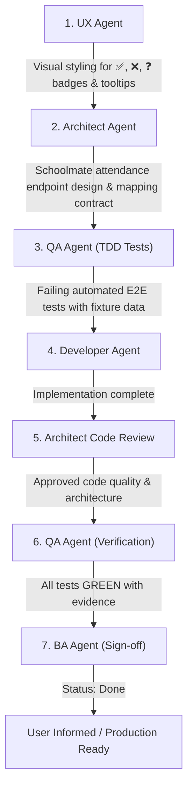

# CRM-015 — Display Per-Student Attendance Status for Group Lessons

**Story ID:** CRM-015  
**Status:** Ready  
**Primary user:** School administrator / Academic manager  
**Related PRD:** [Schedule and Zoom Evidence Review](../PRD.md)  
**Prerequisites / Related Stories:**
- [CRM-013 — Display Group Students Roster on Teacher and Day Pages](CRM-013-display-group-students-roster-on-teacher-and-day-pages.md)

---

## 1. Summary

Following [CRM-013](CRM-013-display-group-students-roster-on-teacher-and-day-pages.md) (which displays the actual roster of students assigned to a group class), this story introduces **per-student attendance tracking** inside the expanded lesson drawer on the Teacher Schedule and Teacher Day Details pages.

For each student in a group or individual lesson, EE-CRM will fetch the specific lesson attendance record from Schoolmate and display a clear visual indicator next to their name:
- `✅` **Present / Attended** — Student was confirmed present in class.
- `❌` **Absent** — Student was marked absent.
- `❓` **Unchecked / Not Marked** — Attendance for this student/lesson has not been checked or recorded yet in Schoolmate.

In addition, the lesson summary header and drawer header will display the accurate aggregate attendance tally derived from actual per-student records (e.g., `4/6 Attended` if 4 out of 6 students attended).

---

## 2. Business Objective

Enable school administrators to audit attendance accuracy with granular per-student clarity. By displaying whether each specific student was present, absent, or unchecked right next to their name, administrators can immediately cross-reference Schoolmate attendance with Zoom participant logs to ensure billing, teacher compensation, and student progress records are accurate.

---

## 3. User Story

As a school administrator,  
I want to see an individual attendance indicator (`✅` Present, `❌` Absent, `❓` Unmarked) next to each student's name in a lesson's roster,  
so that I know exactly which students attended the class and can identify attendance discrepancies against Zoom meeting evidence.

---

## 4. Current-State Findings (Post-CRM-013)

1. [CRM-013](CRM-013-display-group-students-roster-on-teacher-and-day-pages.md) renders the roster of enrolled student names in the expanded lesson drawer (e.g. 6 students for `GIZ Group 8 English Empire`).
2. Aggregate attendance in the legacy codebase was an unverified all-or-nothing flag (`AttendanceChecked` -> assumed 100% attendance).
3. Schoolmate stores granular per-student attendance for each group lesson (present, absent, excused, unrecorded). EE-CRM needs to retrieve and map these individual student statuses.

---

## 5. Visual Indicators & States

| Status | Icon & Visual Treatment | Meaning in Schoolmate | Localized Tooltip / Label |
|---|---|---|---|
| **Present** | `✅` Green checkmark badge | Student attended the lesson | Attended / Був присутній |
| **Absent** | `❌` Red cross badge | Student was absent | Absent / Відсутній |
| **Unchecked** | `❓` Grey / Amber question mark badge | Attendance has not been recorded yet | Unchecked / Не відмічено |

---

## 6. Functional Requirements

1. **Schoolmate Attendance Integration:**
   - Fetch the detailed attendance record for the specific `groupLessonId` from Schoolmate (e.g. from lesson attendance / class register endpoints).
   - Map each student's attendance record by `studentId` to their name in the group roster.

2. **Per-Student Status Rendering:**
   - In the expanded lesson drawer, render each student's row with:
     - Student full name (e.g. `Goncharov Andrii`).
     - Corresponding attendance badge/icon (`✅`, `❌`, or `❓`).
     - Tooltip or accessible text describing the state.

3. **Accurate Aggregate Attendance Calculation:**
   - Calculate total attended count by summing students with status **Present** (`attendedCount`).
   - Calculate total enrolled count (`enrolledCount`).
   - In the lesson header and drawer header, display the accurate summary count:
     - If all marked: `4/6 Attended` (e.g. `4/6 Були присутні`).
     - If attendance unchecked: `Attendance not marked` (`0/6 Checked`).

4. **1-on-1 (Individual) Lessons Consistency:**
   - Apply the same tripartite status (`✅`, `❌`, `❓`) to individual lessons based on the student's lesson status.

5. **Page Consistency & Performance:**
   - Available on both the Teacher Schedule view (`/teachers/[id]`) and Teacher Day Details view (`/teachers/[id]/[date]`).
   - Batch or cache attendance lookups alongside the lesson details to avoid cascading API requests.

---

## 7. Acceptance Criteria

### Scenario 1: Group Lesson with Mixed Attendance
Given a scheduled group lesson for `GIZ Group 8 English Empire` (6 enrolled students)  
And Schoolmate records indicate:
  - 4 students attended (Present)
  - 1 student was absent (Absent)
  - 1 student was not marked (Unchecked)  
When an administrator expands the lesson card on `/teachers/[id]` or `/teachers/[id]/[date]`  
Then the 4 present students display `✅` (Attended)  
And the 1 absent student displays `❌` (Absent)  
And the 1 unchecked student displays `❓` (Unchecked)  
And the lesson summary displays `4/6 Attended`.

### Scenario 2: Group Lesson with All Students Attended
Given all 6 students in `GIZ Group 8 English Empire` attended the class  
When the lesson card is expanded  
Then each of the 6 students displays `✅`  
And the summary displays `6/6 Attended`.

### Scenario 3: Lesson Attendance Not Yet Checked by Teacher
Given a lesson has occurred but the teacher has not marked attendance in Schoolmate  
When the lesson card is expanded  
Then all students display `❓` (Unchecked)  
And the summary displays `Attendance not marked` (or `0/6 Checked`).

### Scenario 4: Individual 1-on-1 Lesson
Given an individual 1-on-1 lesson where the student was marked absent  
When the lesson card is expanded  
Then the student row displays `❌` (Absent)  
And the summary header indicates the lesson was not attended.

---

## 8. Business Rules

1. **Accurate Headcount Derivation:** Aggregate attendance numbers must be strictly derived from individual student attendance records, never assumed or hardcoded.
2. **Attendance Truth:** Schoolmate's recorded lesson attendance is the primary source of truth for student presence.
3. **No Automatic Overwrites:** Zoom participant presence does not automatically change Schoolmate student attendance; visual comparison is presented for administrative auditing.

---

## 9. Permissions & Roles

- Available to all authenticated administrators and academic coordinators.
- Read-only; attendance modification is handled in Schoolmate or a future phase.

---

## 10. Recommended Subtasks & Execution Flow

1. **UX Design:** Specify visual icons (`✅`, `❌`, `❓`), color codes, badge layout, and tooltip interactions next to student names.
2. **Architecture Specification:** Define Schoolmate client methods for lesson attendance fetching (`getLessonStudentAttendance`), caching, and data mapping.
3. **QA Verification (TDD):** Write E2E test suites asserting correct rendering of `✅`, `❌`, and `❓` across test fixtures.
4. **Development Implementation:** Connect Schoolmate attendance data into `TeacherScheduleClient.js` and `TeacherDayDetailsClient.js`.
5. **Architect Code Review:** Verify batching, caching, and error resilience.
6. **QA Final Verification:** Run automated test suite and capture verification reports.
7. **BA Sign-off:** Validate against acceptance criteria and mark CRM-015 as **Done**.

---

## 11. Definition of Ready Checklist

- [x] Business objective and user value clearly defined
- [x] Tripartite status rules (`✅`, `❌`, `❓`) documented
- [x] Acceptance criteria with Given/When/Then scenarios defined
- [x] Dependencies on [CRM-013](CRM-013-display-group-students-roster-on-teacher-and-day-pages.md) explicitly stated
- [x] Execution flow across agent roles specified

---

## 12. Audit Trail

| Date | Decision |
|---|---|
| 29 September 2026 | Created CRM-015 to display granular per-student attendance indicators (`✅`, `❌`, `❓`) in group and individual lesson rosters. |
