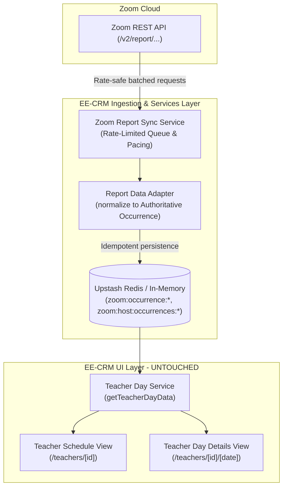
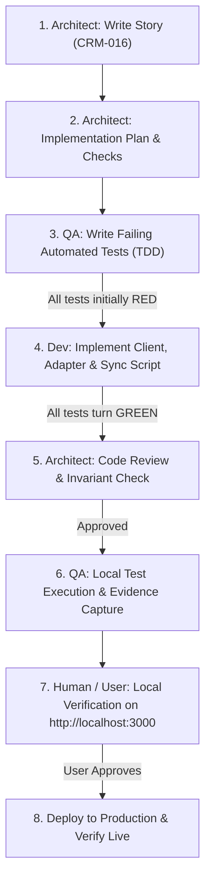

# CRM-016 — Ingest Authoritative Zoom Telemetry via REST API Reports

**Story ID:** CRM-016  
**Status:** Ready  
**Primary user:** School administrator / Integrations engineer  
**Related PRD:** [Schedule and Zoom Evidence Review](../PRD.md)  
**Related Stories:** [CRM-001](./CRM-001-display-tracked-zoom-meetings-on-teacher-page.md), [CRM-003](./CRM-003-migrate-zoom-meetings-and-connect-webhook-ingestion.md), [CRM-005](./CRM-005-complete-one-time-zoom-migration-and-independent-ingestion.md), [CRM-013](./CRM-013-display-group-students-roster-on-teacher-and-day-pages.md)  
**UX Specification:** Skipped (Purely technical backend/infrastructure story; UI layer and visual contracts remain strictly untouched)  
**Related Architecture Plan:** [Architecture: CRM-016 — Ingest Authoritative Zoom Telemetry via REST API Reports](../architecture/CRM-016-ingest-zoom-telemetry-via-rest-api-reports.md)  

---

## 1. Summary & Problem Context

EE-CRM previously relied primarily on Zoom webhooks (`/api/webhooks/zoom`) for capturing live meeting evidence. However, real-world operation identified critical vulnerabilities in webhook-only telemetry:
1. **Best-Effort & Fragile Ingestion:** If a server experiences cold starts (> 3s), temporary downtime during redeployments, or if event subscriptions are misconfigured, webhooks are dropped with no automatic retry or catch-up mechanism. (For example, between 27–29 September 2026, only waiting-room pings were received for Olha Kushnirchuk and zero webhooks were delivered for Yuliia Savchuk).
2. **Missing Historical Scope:** Webhooks cannot retrieve past meetings that occurred before an endpoint was wired or during webhook downtime.
3. **Availability of Zoom Cloud Truth:** The master Zoom organization account (English Empire) has active Server-to-Server OAuth credentials (`ZOOM_ACCOUNT_ID`, `ZOOM_CLIENT_ID`, `ZOOM_CLIENT_SECRET`). Zoom's cloud already maintains complete, definitive reports for past meetings (`/v2/report/users/{userId}/meetings` and `/v2/report/meetings/{meetingId}/participants`) for **all teachers**, including those on Basic/Free tiers.

This story introduces a dedicated, rate-limited **Zoom REST API Reports Ingestion & Sync Layer** that directly synchronizes authoritative meeting occurrences and participant sessions from Zoom's cloud into Redis.

---

## 2. Business Objective & Value

- **100% Data Completeness & Durability:** Replaces lossy webhook dependence with official Zoom cloud records containing exact join/leave timestamps, participant names, reconnect sessions, and durations down to the second.
- **Historical On-Demand Sync:** Empowers administrators to pull past weeks or months of Zoom evidence retroactively for any teacher.
- **Zero UI Regression:** Strictly isolates changes to the services/infrastructure layer; the UI layer consumes the existing occurrence schema without modification.
- **Safe API Consumption:** Incorporates rate-limiting and request pacing to prevent spamming Zoom API endpoints and avoid HTTP 429 rate limit errors.
- **Path to Legacy Cleanup:** Once report-based ingestion is validated locally and in production, fragile legacy webhook archives can be safely decommissioned.

---

## 3. Architectural Boundary & Separation of Concerns

- **UI Layer (Untouched):** Components (`TeacherScheduleClient.js`, `TeacherDayDetailsClient.js`, `GroupStudentRoster.js`) continue to consume occurrences via existing props and contracts.
- **Domain & Persistence (Preserved):** Data is normalized into the existing authoritative occurrence schema (`zoom:occurrence:{safeId}`, `zoom:host:occurrences:{hostEmail}`), queryable via `getZoomOccurrencesForTeacher`.
- **Infrastructure (New/Updated):** Dedicated Zoom Reports client and pacing queue in `lib/infrastructure/zoom.js` (or `zoom-reports-client.js`).

---

## 4. Functional Requirements

### 1. Zoom REST API Authentication & Report Fetching
1. Utilize existing Server-to-Server OAuth credentials (`ZOOM_ACCOUNT_ID`, `ZOOM_CLIENT_ID`, `ZOOM_CLIENT_SECRET`) to obtain bearer tokens with automatic caching and refresh.
2. Implement `fetchPastMeetingsForUser({ zoomUserId, fromDate, toDate })`:
   - Endpoint: `GET https://api.zoom.us/v2/report/users/{userId}/meetings?from={fromDate}&to={toDate}&type=past&page_size=100`
3. Implement `fetchMeetingParticipants({ meetingKey })`:
   - Endpoint: `GET https://api.zoom.us/v2/report/meetings/{meetingKey}/participants?page_size=100`
   - Supports double-encoded UUIDs or numeric meeting IDs.

### 2. Request Pacing, Queue & Rate-Limiting Protection
1. Implement a rate-limiting queue / throttling mechanism to prevent spamming Zoom's API:
   - Target pacing: maximum of **5–10 requests per second** (or batch concurrency limit of 2 with 200ms inter-chunk delay).
   - Automatic HTTP 429 (`Retry-After`) detection and exponential backoff.
   - Timeout guard per request (e.g. 10s bounded timeout).

### 3. Data Transformation & Schema Normalization
1. Transform Zoom Report API meeting and participant payloads into authoritative EE-CRM occurrence records:
   - `occurrence_id` & `uuid`: Zoom meeting UUID.
   - `numeric_meeting_id`: Meeting ID string.
   - `host_email`: Normalized teacher email.
   - `start_time` & `end_time`: ISO 8601 timestamps.
   - `duration_seconds`: Total duration in seconds (`duration * 60`).
   - `duration_state`: `'complete'`.
   - `participants`: Map of canonical participant entities containing:
     - `name`: Display name.
     - `email`: Normalized email or `null`.
     - `user_id`: Zoom session user ID.
     - `is_host`: Boolean (true if `user_id === '16778240'` or matches host).
     - `sessions`: Array of individual session intervals (`join_time`, `leave_time`).
     - `duration_seconds`: Union duration across sessions without overlap inflation.
     - `status`: Preserves `'in_meeting'` vs `'in_waiting_room'` flag.
2. Validate each reconstructed occurrence against `validateOccurrenceInvariants()`.

### 4. Redis Persistence & Indexing
1. Store occurrences under `zoom:occurrence:{safeId}`.
2. Update the teacher host index `zoom:host:occurrences:{hostEmail}` sorted set using the start timestamp epoch ms as the score.
3. Maintain strict idempotency: re-running sync for the same date range must not duplicate records, inflate participant sessions, or corrupt data.

### 5. CLI Sync & Backfill Tooling
1. Provide a standalone CLI tool `ee-crm/scripts/crm-016/sync-zoom-reports.js` (and npm script `npm run sync:zoom:reports`):
   - Supports flags: `--from YYYY-MM-DD`, `--to YYYY-MM-DD`, `--teacher <id|email>`, `--dry-run`.
   - Backfills missing days (specifically verifying September 26–29, 2026).
   - Outputs a structured execution report (meetings discovered, occurrences synced, participants aggregated, errors encountered).

---

## 5. Non-Functional Requirements

1. **Zero UI Impact:** Zero regressions or markup changes in `TeacherScheduleClient.js` or `TeacherDayDetailsClient.js`.
2. **Local-First Verification:** All sync scripts and test suites must execute and pass locally before any production deployment.
3. **Graceful Error Handling:** If a single meeting's participant call fails or returns 404/400, log a warning and continue processing remaining meetings without failing the entire teacher sync.
4. **Memory / Redis Mode Support:** Support running against `InMemoryRedis` during local tests when Upstash credentials are not supplied.

---

## 6. Definition of Done: Verifiable To-Dos & Acceptance Criteria (TDD-Ready)

The following numbered checks define what needs to happen to consider this story done. They must be translated by E2E QA into automated verification tests (preferably End-to-End browser / API tests) that **fail before implementation** and **pass after implementation**:

### Check 1: Rate-Safe Zoom Report Client
- [ ] `fetchPastMeetingsForUser` fetches past meetings for a given teacher ID and date range without throwing.
- [ ] `fetchMeetingParticipants` fetches participants for a given meeting UUID/ID.
- [ ] Request throttling enforces maximum concurrency/pacing and handles HTTP 429 retries with backoff.

### Check 2: Occurrence Adaptation & Invariant Compliance
- [ ] Raw Zoom Report API response is adapted into the authoritative occurrence schema.
- [ ] Multiple session intervals for reconnecting participants are merged using interval union (no double-counting duration).
- [ ] Waiting-room-only participants (who were never admitted) are captured with `status: 'in_waiting_room'`.
- [ ] Every adapted occurrence passes `validateOccurrenceInvariants({ valid: true, errors: [] })`.

### Check 3: Query & Persistence Integrity in Redis
- [ ] Synced occurrences are written to `zoom:occurrence:{safeId}` and indexed in `zoom:host:occurrences:{hostEmail}`.
- [ ] `getZoomOccurrencesForTeacher({ teacherZoomEmail, fromDate, toDate })` returns the synced occurrences sorted chronologically.
- [ ] Re-running the sync tool for the same date range is strictly idempotent (occurrence count and participant lists remain identical).

### Check 4: Historical Target Dataset Verification (26–29 Sep 2026)
- [ ] Syncing 2026-09-28 to 2026-09-29 restores:
  - **Olha Kushnirchuk** (`helhakushnirchuk@gmail.com`): 9 meetings with full participant records (e.g. *Аліса Салієнко* ~62 min, *Dmytro Dushkevych* ~55 min, *Oleksandr Hubskyi* ~58 min, *Yaryna* ~58 min).
  - **Yuliia Savchuk** (`yuliasavchuk03@gmail.com`): 5 meetings with full participant records (e.g. *Artem*, *bevz.s*, *Анна Козачук*, *Serg Voronkov*, *Roman Pecheniuk*).
  - **Irina Zhuravleva** (`zhur.zhur.irene@gmail.com`): Meetings with *Павло Симоненко*.

### Check 5: UI & End-to-End Contract Preservation
- [ ] `GET /api/teachers/[id]/days/[date]` returns `zoom.state: 'available'` and the complete list of meetings and participants.
- [ ] Day details page HTML renders the Zoom evidence column without errors and with zero UI modifications.

---

## 7. Multi-Agent Execution Flow & Quality Gates

1. **Architect Agent:** Creates the Story (this file) and the Technical Architecture Plan (`ee-crm/docs/architecture/CRM-016-ingest-zoom-telemetry-via-rest-api-reports.md`).
2. **QA Agent (TDD Gate):** Writes automated verification tests (`ee-crm/test-crm-016-zoom-reports.js` and E2E checks). Confirms that tests fail prior to development.
3. **Developer Agent:** Implements the Zoom Report Client, rate-limiting queue, data adapter, and sync script (`scripts/crm-016/sync-zoom-reports.js`). Validates that all QA tests become green.
4. **Architect Code Review Gate:** Reviews implementation for layer isolation, rate-limiting correctness, and schema invariants.
5. **QA Verification Gate:** Runs full test suite locally and generates a verification report with evidence.
6. **Human / User Local Gate:** User tests locally on `http://localhost:3000` to verify meeting evidence and participants.
7. **Production Cutover:** Code is pushed and deployed to production only after local human approval.

---

## 8. Definition of Ready Checklist

- [x] Purely technical scope defined (UI layer strictly untouched)
- [x] Business objective and rationale for REST API over webhooks established
- [x] Rate-limiting and pacing requirements specified
- [x] Target historical verification dataset (Sep 26–29 for Kushnirchuk & Savchuk) defined
- [x] Acceptance criteria structured for TDD verification by QA
- [x] Multi-agent quality gates and local-first human verification workflow defined
