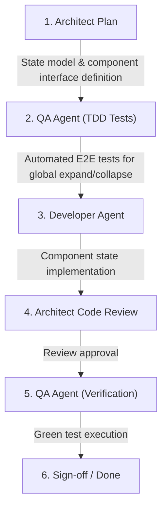

# CRM-017 — Expand/Collapse All Includes Zoom Meetings

**Story ID:** CRM-017  
**Status:** Ready  
**Primary user:** School administrator / Academic manager  
**Related PRD:** [Schedule and Zoom Evidence Review](../PRD.md)  
**Depends on:** CRM-001 — Display tracked Zoom meetings on teacher page, CRM-002 — View teacher-day details  

## Summary

Currently, the "Expand All" / "Collapse All" action on schedule and details views (such as the Teacher Schedule and Teacher Day Details pages) only controls the expansion state of Schoolmate lesson cards/drawers, leaving tracked Zoom meetings in their collapsed state.

This story updates the "Expand All" / "Collapse All" functionality so that triggering "Expand All" expands all collapsible items on the page—both Schoolmate lessons (roster/details) and Zoom meetings (meeting details, participant rosters, and timestamps). Triggering "Collapse All" collapses all Schoolmate lessons and Zoom meetings simultaneously.

## Business objective

Allow administrators and academic managers to inspect all daily evidence (both scheduled Schoolmate lessons and observed Zoom telemetry) with a single click, eliminating the need to manually click into every Zoom meeting individually when auditing a teacher's full schedule.

## User story

As a school administrator,  
I want the "Expand All" button to expand both Schoolmate lessons and Zoom meetings across the page,  
so that I can quickly view all lesson details and Zoom meeting participant evidence side-by-side without manually opening each meeting.

## Current-state findings

1. The "Expand All" / "Collapse All" button currently toggles only Schoolmate lesson cards.
2. Zoom meeting cards/drawers remain collapsed when "Expand All" is clicked, requiring administrators to manually expand each Zoom meeting occurrence to view participant logs, join/leave times, and meeting details.
3. Users expect "Expand All" to apply universally to all collapsible evidence cards present on the current view.

## Functional requirements

1. **Global Toggle Behavior**:
   - Clicking "Expand All" must expand all Schoolmate lesson cards and all Zoom meeting cards/details visible on the current page.
   - Clicking "Collapse All" must collapse all Schoolmate lesson cards and all Zoom meeting cards/details visible on the current page.
2. **Synchronized State Tracking**:
   - The button label and icon must reflect the aggregated state (e.g., showing "Collapse All" when all items are expanded, and "Expand All" when all or some items are collapsed).
   - If individual cards are manually toggled, the global toggle state should update accordingly or gracefully handle subsequent toggle actions.
3. **Multi-Section Support**:
   - Applies to the Teacher Schedule view (`/teachers/[teacherId]`) across all displayed days/cards.
   - Applies to the Teacher Day Details view (`/teachers/[teacherId]/[YYYY-MM-DD]`).
4. **Detail Visibility**:
   - Expanded Zoom meetings must show their full details, including topic, start/end time, duration, participant roster, participant roles, and individual session durations.
5. **Performance & Rendering**:
   - Expanding multiple Zoom meetings and Schoolmate lessons simultaneously must not cause UI lag, jank, or unhandled exceptions.

## Acceptance criteria

### Scenario 1: Expand All on Teacher Day Details page
Given an administrator is viewing a Teacher Day Details page (`/teachers/[id]/[date]`) with 3 Schoolmate lessons and 2 Zoom meetings  
And all lesson and meeting cards are initially collapsed  
When the administrator clicks "Expand All"  
Then all 3 Schoolmate lesson cards are expanded showing lesson details and student rosters  
And both Zoom meeting cards are expanded showing meeting info and participant sessions  
And the toggle button state updates to "Collapse All".

### Scenario 2: Collapse All on Teacher Day Details page
Given all Schoolmate lessons and Zoom meetings on the Teacher Day Details page are currently expanded  
When the administrator clicks "Collapse All"  
Then all Schoolmate lesson cards collapse  
And all Zoom meeting cards collapse  
And the toggle button state updates to "Expand All".

### Scenario 3: Expand All on Teacher Schedule overview page
Given an administrator is viewing the Teacher Schedule page (`/teachers/[id]`) with multiple days containing lessons and Zoom meetings  
When the administrator clicks "Expand All"  
Then all Schoolmate lessons and all Zoom meetings across all visible days are expanded.

### Scenario 4: Page with Only Zoom Meetings
Given a teacher-day has 0 Schoolmate lessons and 2 Zoom meetings  
When the administrator clicks "Expand All"  
Then all Zoom meeting cards are expanded  
And when clicking "Collapse All", all Zoom meeting cards are collapsed.

### Scenario 5: Individual Card Interaction after Global Expand
Given all lessons and Zoom meetings have been expanded via "Expand All"  
When the administrator manually clicks to collapse one Zoom meeting  
Then only that specific Zoom meeting collapses while all other lessons and meetings remain expanded  
And clicking "Expand All" expands that collapsed Zoom meeting back.

## UX Requirements

[Link to UX specification / Design standard]: Consistent button styling and toggle behavior with existing UI components; ensure clear chevron indicators on both lesson and meeting cards.

## Definition of Done: Verifiable To-Dos

Clear, descriptive, and understandable checks defining what needs to happen to see that this story is done. E2E QA will create automated verification tests directly against each numbered to-do before development starts:

1. Verify that clicking "Expand All" on the Teacher Day Details page (`/teachers/[id]/[date]`) expands all Schoolmate lesson cards and reveals their details/rosters.
2. Verify that clicking "Expand All" on the Teacher Day Details page (`/teachers/[id]/[date]`) expands all Zoom meeting cards and reveals meeting details and participant lists.
3. Verify that clicking "Collapse All" on the Teacher Day Details page collapses all Schoolmate lesson cards and all Zoom meeting cards.
4. Verify that clicking "Expand All" on the Teacher Schedule view (`/teachers/[id]`) expands all Schoolmate lessons and all Zoom meetings across the displayed date range.
5. Verify that clicking "Collapse All" on the Teacher Schedule view collapses all Schoolmate lessons and all Zoom meetings across the displayed date range.
6. Verify that on a page with only Zoom meetings (no Schoolmate lessons), "Expand All" and "Collapse All" correctly expand and collapse all Zoom meeting cards.

## Business rules

1. "Expand All" represents a universal view mode for full administrative audit; it must never selectively omit Zoom meeting telemetry.
2. Collapsing or expanding items must be non-destructive and preserve loaded data without triggering unnecessary network refetches.

## Permissions and roles

- Available to all authenticated administrators and coordinators with access to the Teacher Schedule and Teacher Day Details pages.

## Data requirements

- No backend schema or API changes required. Operates on the client-side expansion/collapse state of Schoolmate lessons and Zoom meeting occurrences.

## Edge cases and error handling

- **No Zoom meetings present:** "Expand All" functions normally for Schoolmate lessons without errors.
- **No Schoolmate lessons present:** "Expand All" functions normally for Zoom meetings without errors.
- **Empty state (neither present):** "Expand All" button is disabled or handles empty state gracefully.
- **Large number of meetings/lessons:** State transitions remain responsive and smooth.

## Dependencies

- [CRM-001 — Display tracked Zoom meetings on teacher page](CRM-001-display-tracked-zoom-meetings-on-teacher-page.md)
- [CRM-002 — View teacher-day details](CRM-002-teacher-day-details-page.md)
- [Architecture Plan](../architecture/CRM-017-expand-all-includes-zoom-meetings.md)

## Recommended subtasks

1. **Architect Planning:** Define unified card expansion state management or shared disclosure context across lesson and Zoom meeting components.
2. **QA Pre-implementation Tests:** Author failing E2E tests validating To-Dos #1–#6.
3. **Developer Implementation:** Update page controls and Zoom meeting components to bind to the global expand/collapse state.
4. **Architect Code Review:** Verify clean state handling, accessibility, and performance.
5. **QA Verification:** Execute test suite and confirm all verification checks pass.

## Assumptions

- Zoom meeting cards already have collapsible/expandable detail sections for participant logs.
- The global expand/collapse toggle exists on the Teacher Schedule and Teacher Day Details views.

## Out of scope

- Persisting expanded/collapsed state to local storage across page reloads.
- Filtering or selective partial expansion by tags or status.

## Open questions

- None. Requirements and scope are clear.

## Definition of Ready checklist

- [x] Business objective and user are clear
- [x] Acceptance criteria are testable
- [x] Numbered Verifiable To-Dos (Definition of Done) are clearly defined for QA test creation
- [x] Rules and validation are documented
- [x] Permissions and data requirements are documented
- [x] Edge cases and dependencies are covered
- [x] Open questions are resolved or explicitly accepted
- [x] Required UX and technical dependencies are linked

## Audit trail

| Date | Decision |
|---|---|
| 30 September 2026 | Created CRM-017 to expand both Schoolmate lessons and Zoom meetings on "Expand All" action. |
