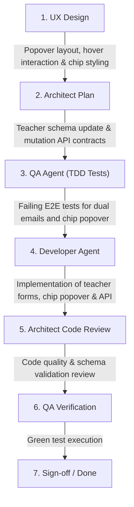

# CRM-018 — Manage Teacher Personal and Corporate Zoom Emails

**Story ID:** CRM-018  
**Status:** Ready  
**Primary user:** School administrator / Academic manager  
**Related PRD:** [Schedule and Zoom Evidence Review](../PRD.md)  
**Depends on:** CRM-001 — Display tracked Zoom meetings on teacher page, CRM-002 — View teacher-day details, CRM-012 — Display Zoom organization membership date  

---

## 1. Summary

Currently, teacher identification in EE-CRM primarily relies on a single email address (often the teacher's personal email). The school is actively transitioning all teachers from personal email accounts to official corporate organization emails on Zoom.

This story enables administrators to manage two distinct email addresses for each teacher:
1. **Personal Email** (contact / Schoolmate record)
2. **Corporate Email** (designated official organization account used for Zoom host association)

Furthermore, on both the **Teacher Overview Page** (`/teachers/[id]`) and **Teacher Day Details Page** (`/teachers/[id]/[date]`), the Zoom host chip in the header becomes interactive: hovering or clicking on the chip reveals a management popover allowing administrators to view, edit, or switch the active Zoom host email in-place without leaving their review workflow.

---

## 2. Business Objective

Facilitate a smooth, manageable organizational migration from personal teacher emails to corporate emails in Zoom. Administrators can configure both personal and corporate emails when creating or updating teacher profiles and seamlessly switch or edit the active Zoom host mapping directly from daily auditing screens.

---

## 3. User Story

As a school administrator,  
I want to specify both a personal email and a corporate email for each teacher, and quickly edit or switch the Zoom host email via the header chip on teacher and day pages,  
so that I can easily migrate our teachers to corporate Zoom accounts and ensure Zoom telemetry maps accurately to the correct teacher.

---

## 4. Current-State Findings

1. Teacher records currently store a primary email and an optional fallback `zoomHostEmail`.
2. When creating or configuring teachers, there is no explicit two-email model (Personal vs Corporate) presented to administrators.
3. The Zoom host chip displayed on `/teachers/[id]` and `/teachers/[id]/[date]` (e.g. showing "Zoom host: {email}") is static / read-only.
4. Administrators need an intuitive in-place mechanism to update the mapped Zoom email when a teacher receives their corporate credentials.

---

## 5. Functional Requirements

1. **Dual Email Teacher Profile Configuration**:
   - When adding a new teacher or editing an existing teacher profile in administration settings/dialogs, provide two distinct fields:
     - **Personal Email**: Required contact email.
     - **Corporate Email**: Optional/Required corporate email designated for organization Zoom usage.
   - Allow setting the active **Zoom Host Email** to either the corporate email (default recommended) or the personal email.

2. **Interactive Zoom Host Chip on Teacher & Day Pages**:
   - On the Teacher Schedule page (`/teachers/[id]`) and Teacher Day Details page (`/teachers/[id]/[date]`), the Zoom host chip (e.g., `Zoom host: teacher@domain.com`) must support interactive hover / click inspection.
   - Interacting with the chip opens a lightweight contextual popover/modal displaying:
     - Current Personal Email.
     - Current Corporate Email.
     - Active Zoom Host Email selector / input.
     - Direct "Edit / Save" action.

3. **In-Place Email Editing & Updating**:
   - Administrators can modify the corporate email or switch the active Zoom host email directly inside the popover.
   - Upon saving:
     - The updated emails are persisted to the teacher record.
     - The Zoom host chip immediately reflects the new active email.
     - Associated Zoom membership status (`CRM-012`) and meeting telemetry for the teacher refresh according to the newly mapped Zoom email without requiring a hard browser reload.

4. **Input Validation**:
   - Validate email formats strictly before saving.
   - Ensure trimmed, lowercase normalization for Zoom mapping lookups.
   - Prevent saving empty values as the active Zoom host email if both emails are blank.

---

## 6. Acceptance Criteria

### Scenario 1: Adding a Teacher with Personal and Corporate Emails
Given an administrator is adding a new teacher  
When they enter a Personal Email (`teacher.personal@gmail.com`) and a Corporate Email (`teacher@schoolcorp.com`)  
And save the teacher record  
Then both emails are stored  
And `teacher@schoolcorp.com` is configured as the active Zoom host email.

### Scenario 2: Inspecting and Updating Zoom Host Chip on Teacher Day Page
Given an administrator is on the Teacher Day Details page (`/teachers/101/2026-09-30`)  
And the teacher currently has Zoom mapped to their personal email `teacher.personal@gmail.com`  
When the administrator hovers over or clicks the Zoom host chip in the header  
Then an interactive popover opens showing the Personal Email and Corporate Email fields  
When the administrator enters `teacher@schoolcorp.com` as the Corporate Email and clicks Save  
Then the teacher record is updated  
And the Zoom host chip updates to display `teacher@schoolcorp.com`  
And the page's Zoom membership and telemetry data re-evaluate using the corporate email.

### Scenario 3: Switching Active Zoom Host Email between Personal and Corporate
Given a teacher has both a Personal Email (`teacher@gmail.com`) and Corporate Email (`teacher@schoolcorp.com`) configured  
When an administrator interacts with the Zoom host chip and selects the Corporate Email as active  
And confirms the change  
Then future and current Zoom activity matching uses `teacher@schoolcorp.com`.

### Scenario 4: Validation Error on Invalid Email Format
Given an administrator attempts to update the corporate email via the Zoom host popover with an invalid format (e.g. `invalid-email-address`)  
When they attempt to save  
Then an inline validation error is displayed  
And no persistence change or state mutation occurs.

---

## 7. UX Requirements

- **Interactive Chip Styling:** The Zoom host chip should show a subtle hover state (e.g. tooltip indicator, pencil icon, or dropdown arrow) indicating that it is actionable.
- **Popover Behavior:**
  - Accessible via click or hover-focus.
  - Contains clear labels: "Personal Email", "Corporate Email (Zoom)", and "Active Zoom Host".
  - Quick Save and Cancel buttons with smooth loading/success micro-feedback.

---

## 8. Definition of Done: Verifiable To-Dos

Clear, descriptive, and understandable checks defining what needs to happen to see that this story is done. E2E QA will create automated verification tests directly against each numbered to-do before development starts:

1. Verify that the teacher addition/edit form accepts both a "Personal Email" and a "Corporate Email" field.
2. Verify that saving a teacher with both emails sets the active Zoom host mapping to the specified Zoom email.
3. Verify that on the Teacher Overview page (`/teachers/[id]`), clicking/hovering the Zoom host chip opens an in-place popover displaying personal and corporate email details.
4. Verify that on the Teacher Day Details page (`/teachers/[id]/[date]`), clicking/hovering the Zoom host chip opens the in-place popover displaying personal and corporate email details.
5. Verify that editing the Corporate / Zoom email within the popover and saving persists the update and immediately refreshes the chip text.
6. Verify that invalid email entries in the popover display a validation error and prevent saving.

---

## 9. Business Rules

1. **Zoom Association Authority:** The designated active Zoom host email is the authoritative key used to match Zoom webhook telemetry and organization membership (`CRM-012`).
2. **Non-destructive Migration:** Adding or updating a corporate email must not delete or overwrite historical meeting evidence previously recorded under the personal email.
3. **Primary Contact Integrity:** Personal email remains preserved as the primary contact identity in Schoolmate integration unless explicitly updated.

---

## 10. Permissions and Roles

- Restrict email editing to authenticated administrators and academic managers.
- Read-only users (if any in future) can view the chip without edit actions.

---

## 11. Data Requirements

- Extended Teacher schema fields:
  - `personalEmail`: String (valid email format).
  - `corporateEmail`: String | null (valid email format).
  - `zoomHostEmail`: String (active email pointer, defaults to corporate if available, otherwise personal).
- Teacher mutation API endpoint supporting partial or full email updates.

---

## 12. Edge Cases and Error Handling

- **Network Failure on Save:** Popover displays an error banner and retains the user's edits for retry.
- **Teacher with only Personal Email:** Corporate email is displayed as empty/unconfigured with a prompt to "Add corporate email".
- **Duplicate Corporate Email:** Warn if another teacher already uses the identical corporate email address.

---

## 13. Dependencies

- [CRM-001 — Display tracked Zoom meetings on teacher page](CRM-001-display-tracked-zoom-meetings-on-teacher-page.md)
- [CRM-002 — View teacher-day details](CRM-002-teacher-day-details-page.md)
- [CRM-012 — Display Zoom organization membership date](CRM-012-display-zoom-organization-membership-date.md)

---

## 14. Recommended Subtasks

1. **UX Design:** Design the interactive popover layout, hover micro-interactions, and visual feedback for saving.
2. **Architecture Specification:** Define teacher schema extensions (`personalEmail`, `corporateEmail`, `zoomHostEmail`) and server action / API contracts for in-place updates.
3. **QA Pre-implementation Tests:** Author failing E2E tests covering To-Dos #1–#6.
4. **Developer Implementation:** Update teacher creation forms, header Zoom host chip component with interactive popover, and backend mutation handlers.
5. **Architect Code Review:** Verify data integrity, normalization, and error handling.
6. **QA Final Verification:** Run automated test suites and verify all scenarios pass.

---

## 15. Definition of Ready Checklist

- [x] Business objective and user are clear
- [x] Acceptance criteria are testable (Given/When/Then)
- [x] Numbered Verifiable To-Dos (Definition of Done) are clearly defined for QA test creation
- [x] Rules and validation are documented
- [x] Permissions and data requirements are documented
- [x] Edge cases and dependencies are covered
- [x] Open questions are resolved or explicitly accepted
- [x] Required UX and technical dependencies are linked

---

## 16. Audit Trail

| Date | Decision |
|---|---|
| 30 September 2026 | Created CRM-018 to support Personal vs Corporate emails for teachers and in-place Zoom email editing via the header chip on teacher and day pages. |
