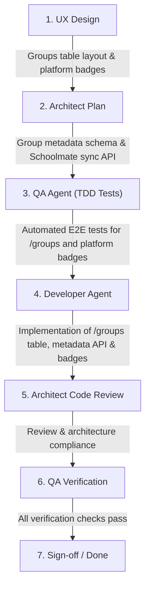

# CRM-019 — Manage Groups Directory and External Meeting Platforms (Teams / Google Meet)

**Story ID:** CRM-019  
**Status:** Ready  
**Primary user:** School administrator / Academic coordinator  
**Related PRD:** [Schedule and Zoom Evidence Review](../PRD.md)  
**Depends on:** CRM-001 — Display tracked Zoom meetings on teacher page, CRM-002 — View teacher-day details, CRM-013 — Display group students roster on teacher and day pages  

---

## 1. Summary

Certain corporate client groups conduct their lessons on external corporate meeting platforms (such as client-provided **Microsoft Teams** or **Google Meet**) rather than the school's managed Zoom accounts. Currently, administrators reviewing teacher schedules see these lessons without knowing their delivery platform, leading to confusion when no Zoom telemetry is found.

This story introduces:
1. A **Dedicated Groups Directory Table** (`/groups`) that automatically syncs and displays group data from Schoolmate (Group Name, ID, Teacher, Enrolled Students count, Status).
2. **Platform Configuration for Groups**: Ability to specify the delivery platform for each group:
   - `None` (Default): Lessons take place in standard school Zoom meetings.
   - `Teams`: Lessons take place on the client's Microsoft Teams.
   - `Meet`: Lessons take place on the client's Google Meet.
3. **Lesson Platform Badges**: Renders the respective platform icon/badge (`Teams` or `Google Meet`) on all lesson cards belonging to that group across the application (Teacher Schedule and Teacher Day Details pages), indicating to administrators that Zoom telemetry review is not expected for these lessons.

---

## 2. Business Objective

Prevent unnecessary investigation and false alarms during schedule auditing. By marking groups that operate on Microsoft Teams or Google Meet, administrators immediately recognize why no Zoom telemetry is recorded for those lessons.

---

## 3. User Story

As a school administrator,  
I want to view all synced Schoolmate groups in a dedicated table and set whether a group uses Microsoft Teams, Google Meet, or Zoom (Default),  
so that lesson cards automatically display the appropriate platform badge and I know not to look for Zoom telemetry for external platform lessons.

---

## 4. Current-State Findings

1. Groups are not centrally browsable in a dedicated EE-CRM directory table; group data is only fetched dynamically per teacher.
2. All lessons are presented as if they should have corresponding Zoom meetings, causing administrators to flag missing Zoom evidence for corporate classes held on Teams or Google Meet.
3. EE-CRM does not author or create groups from scratch; Schoolmate is the primary system of record for group creation and student enrollment.

---

## 5. Platform Values & Visual Indicators

| Platform Key | Label | Meaning | Visual Indicator / Icon | Auditing Expectation |
|---|---|---|---|---|
| `None` *(Default)* | **Zoom (Standard)** | Lessons use the school's Zoom meetings | *(Standard / No external badge)* | Zoom telemetry expected & audited |
| `Teams` | **Microsoft Teams** | Lessons use client/corporate Microsoft Teams | 🟦 `Teams` badge with MS Teams icon | No Zoom telemetry expected |
| `Meet` | **Google Meet** | Lessons use client/corporate Google Meet | 🟩 `Meet` badge with Google Meet icon | No Zoom telemetry expected |

---

## 6. Functional Requirements

1. **Dedicated Groups Directory View (`/groups`)**:
   - Provide a top-level navigation item and dedicated page for "Groups" (`/groups`).
   - Display a responsive data table of groups synced from Schoolmate.
   - Table columns:
     - Group Name (e.g. `GIZ Group 8 English Empire`)
     - Schoolmate Group ID
     - Assigned Teacher(s)
     - Student Count / Enrolled Roster preview
     - Lesson Delivery Platform (`Zoom (Default)`, `Microsoft Teams`, `Google Meet`)
     - Actions (Platform Selector / Edit)
   - Search/Filter by group name and platform.

2. **Group Platform Metadata Management**:
   - Groups are not created manually in EE-CRM; they are synchronized from Schoolmate.
   - Administrators can update a group's platform setting (`None`, `Teams`, `Meet`) directly in the table via inline dropdown or an edit modal.
   - Persist group platform metadata in EE-CRM database/Redis (keyed by `groupId`).

3. **Lesson Card Platform Badging**:
   - On the Teacher Schedule page (`/teachers/[id]`) and Teacher Day Details page (`/teachers/[id]/[date]`):
     - Check the group's configured platform.
     - If `Teams`: Display a clear Microsoft Teams icon/badge on the lesson card and drawer header.
     - If `Meet`: Display a clear Google Meet icon/badge on the lesson card and drawer header.
     - If `None` (Default): Render standard lesson styling without an external platform badge.
   - Tooltip on external platform badges: *"Conducted on client Microsoft Teams / Google Meet — Zoom tracking not applicable"*.

4. **Independent Source Synchronization**:
   - Provide a "Sync Groups" action on the `/groups` page to refresh group list and metadata from Schoolmate on demand.

---

## 7. Acceptance Criteria

### Scenario 1: Groups Directory Table Loads Synced Groups
Given an administrator navigates to `/groups`  
When the page loads  
Then the table displays groups synced from Schoolmate with Group Name, ID, assigned teacher, student count, and current platform setting.

### Scenario 2: Configuring a Group to use Microsoft Teams
Given a group `Corporate Client A` is configured with platform `None` (Default)  
When an administrator selects `Microsoft Teams` from the platform selector for `Corporate Client A`  
Then the setting is saved to EE-CRM storage  
And the group table immediately shows `Microsoft Teams` for that group.

### Scenario 3: Lesson Displays Teams Badge on Teacher Schedule and Day Details
Given group `Corporate Client A` is configured with platform `Teams`  
When an administrator views the teacher schedule (`/teachers/[id]`) or day details (`/teachers/[id]/[date]`) for a day containing a lesson with `Corporate Client A`  
Then that lesson card displays a visible `Microsoft Teams` badge  
And the badge tooltip clarifies that Zoom evidence is not applicable.

### Scenario 4: Lesson Displays Google Meet Badge
Given group `Corporate Client B` is configured with platform `Meet`  
When an administrator views a lesson for `Corporate Client B`  
Then the lesson card displays a visible `Google Meet` badge.

### Scenario 5: Default Group Displays Standard Styling
Given group `General English 101` has platform set to `None` (Default)  
When an administrator views a lesson for `General English 101`  
Then no external platform badge is displayed, and standard Zoom evidence auditing applies.

---

## 8. UX Requirements

- Navigation: Add "Groups" to the main header navigation alongside "Teachers".
- Table Layout: Clean, searchable table with clear sorting and responsive pagination or virtualized list.
- Badges: Recognizable brand-accurate icons and distinct colors for `Teams` (Microsoft blue/purple) and `Google Meet` (Google green/multi-color badge).

---

## 9. Definition of Done: Verifiable To-Dos

Clear, descriptive, and understandable checks defining what needs to happen to see that this story is done. E2E QA will create automated verification tests directly against each numbered to-do before development starts:

1. Verify that navigating to `/groups` loads the Groups directory table with Schoolmate synced groups (Name, ID, Teacher, Student Count, Platform).
2. Verify that updating a group's platform to `Teams` persists the setting in EE-CRM storage.
3. Verify that updating a group's platform to `Meet` persists the setting in EE-CRM storage.
4. Verify that on the Teacher Schedule page (`/teachers/[id]`), lessons for a `Teams` group display a visible Microsoft Teams badge.
5. Verify that on the Teacher Schedule page (`/teachers/[id]`), lessons for a `Meet` group display a visible Google Meet badge.
6. Verify that on the Teacher Day Details page (`/teachers/[id]/[date]`), lessons for a `Teams` or `Meet` group display their respective platform badges.
7. Verify that lessons for groups with platform `None` display standard styling without an external platform badge.

---

## 10. Business Rules

1. **Schoolmate Authority for Group Existence:** Groups are mastered in Schoolmate and synced to EE-CRM; administrators do not manually create or delete groups in EE-CRM.
2. **Default is Zoom:** Any group without an explicit platform override defaults to `None` (Zoom).
3. **Audit Exemption Awareness:** External platform badges are visual aids for administrators during manual audit; they do not alter historical Schoolmate schedule or payroll figures.

---

## 11. Permissions and Roles

- Accessible to authenticated administrators and academic coordinators.
- Modifying group platform settings is restricted to administrators.

---

## 12. Data Requirements

- Synced Group model:
  - `groupId`: String / Number (authoritative Schoolmate ID).
  - `name`: String.
  - `teacherId` / `teacherName`: String.
  - `studentCount`: Number.
  - `platform`: Enum (`'None'` | `'Teams'` | `'Meet'`), defaults to `'None'`.
  - `updatedAt`: ISO Timestamp.
- EE-CRM Group Metadata storage under key `eecrm:group:metadata:{groupId}`.

---

## 13. Edge Cases and Error Handling

- **New Group from Schoolmate:** Automatically appears in the table with default platform `None`.
- **Schoolmate Sync Downtime:** Table displays cached group records with a notice if sync fails.
- **Individual (1-on-1) Lessons:** Individual lessons do not belong to group classes and default to standard Zoom tracking unless individual overrides are introduced in a future story.

---

## 14. Dependencies

- [CRM-001 — Display tracked Zoom meetings on teacher page](archived/CRM-001-display-tracked-zoom-meetings-on-teacher-page.md)
- [CRM-002 — View teacher-day details](archived/CRM-002-teacher-day-details-page.md)
- [CRM-013 — Display group students roster on teacher and day pages](CRM-013-display-group-students-roster-on-teacher-and-day-pages.md)

---

## 15. Recommended Subtasks

1. **UX Design:** Specify table design for `/groups`, navigation link, and platform badge styling (`Teams`, `Meet`).
2. **Architecture Specification:** Define group metadata persistence contract, sync endpoints, and lesson enrichment logic.
3. **QA Pre-implementation Tests:** Author failing E2E tests covering To-Dos #1–#7.
4. **Developer Implementation:** Build `/groups` route, table, inline platform selector, and lesson badge components.
5. **Architect Code Review:** Verify sync performance, caching, and clean layer boundaries.
6. **QA Final Verification:** Run automated test suites and verify all scenarios pass.

---

## 16. Definition of Ready Checklist

- [x] Business objective and user are clear
- [x] Acceptance criteria are testable (Given/When/Then)
- [x] Numbered Verifiable To-Dos (Definition of Done) are clearly defined for QA test creation
- [x] Rules and validation are documented
- [x] Permissions and data requirements are documented
- [x] Edge cases and dependencies are covered
- [x] Open questions are resolved or explicitly accepted
- [x] Required UX and technical dependencies are linked

---

## 17. Audit Trail

| Date | Decision |
|---|---|
| 30 September 2026 | Created CRM-019 for dedicated Groups directory table and external platform tagging (`Teams`, `Meet`, `None`). |
